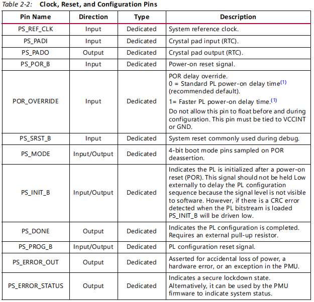

# **Zynq UltraScale+ Device** **Technical Reference Manual**


[TOC]


# Chapter1:  Introduction                                          

## **Introduction to the UltraScale Architecture**

AMD UltraScale™ 架构通过智能处理实现系统性能达到每秒数百吉比特的水平，同时在芯片上有效地路由和处理数据。基于 UltraScale 架构的设备通过使用行业领先的技术创新，包括下一代路由技术、类似 ASIC 的时钟系统、3D-on-3D IC 技术、多处理器 SoC 技术以及新的功耗降低特性，来满足广泛的高带宽、高利用率系统要求。这些设备共享许多构建模块，提供跨工艺节点和产品系列的可扩展性，使系统级投资能够跨平台应用。

所有 AMD Zynq™ UltraScale+ 设备在提供 64 位处理器可扩展性的同时，结合了用于图形、视频、波形和数据包处理能力的实时控制硬件引擎，这些都集成在可编程逻辑中。集成基于 Arm® 的系统进行高级分析，并在芯片上的可编程逻辑中进行任务加速，为包括 5G 无线、下一代 ADAS 和工业物联网等应用创造了无限可能性。

RFSoC 设备与基本的 MPSoC 设备相似，但增加了关键的 RF 子系统，适用于多频段、多模式的蜂窝无线电和有线基础设施（DOCSIS）。RFSoC 设备将处理系统与位于 RF-ADC、RF-DAC 和软判决 FEC（SD-FEC）单元附近的可编程逻辑结合在一起，使得可以在单一的高度可编程 SoC 上实现完整的软件定义无线电，包括直接 RF 采样数据转换器，实现 CPRI™ 和多千兆比特以太网到 RF 的转换。

表 1-1 显示了主要功能单元和外设。有关 TRM 的更多信息，请参见附录 A 中的参考文献、AMD 文档导航器和 Zynq UltraScale+ 文档网站 [参考文献 1]。

## **Application Overview**

Zynq UltraScale+ MPSoC 是 AMD 的第二代 Zynq 平台，将强大的处理系统（PS）和用户可编程逻辑（PL）集成于同一芯片中。处理系统配备了 Arm® 旗舰 Cortex®-A53 64位四核或双核处理器和 Cortex-R5F 双核实时处理器。除了之前 Zynq 7000 设备提供的成本和集成优势外，Zynq UltraScale+ MPSoC 和 RFSoC 设备还提供了以下新特性和优势：
- 可扩展的处理系统，可根据功率和性能进行调整。

- 低功耗运行模式和睡眠模式。

- 灵活的用户可编程功率和性能调节。

- 高级配置系统，支持设备和用户安全。

- 扩展的连接性支持，包括在处理系统中的 PCIe®、SATA 和 USB 3.0。

- 先进的用户界面，处理系统中集成 GPU 和 DisplayPort。

- 配备多达 16 通道 RF-ADC 和 RF-DAC 的射频电路（RFSoC 设备）。

- 增加的 DRAM 和 PS-PL 带宽。

- 使用 Arm 的高级 QoS 调节器改善内存流量。

- 改进的安全性和可靠性。
  这些新设备提供 FPGA 的灵活性和可扩展性，同时提供与 ASIC 和 ASSP 相关的性能、功率和易用性。Zynq UltraScale+ 系列的范围使设计师能够使用行业标准工具，针对成本敏感型和高性能应用，从单一平台设计。处理系统有两种版本：双核 Cortex-A53 和四核 Cortex-A53。可编程逻辑的特性因设备类型而异。因此，Zynq UltraScale+ MPSoCs 能够服务于广泛的应用领域，包括：

- 汽车驾驶辅助、驾驶信息和娱乐系统。

- 广播摄像机。

- 工业电机控制、工业网络和机器视觉。

- IP 和智能相机。

- LTE 无线电和基带。

- 医疗诊断和成像。

- 多功能打印机。

- 视频和夜视设备。

- 无线电。
  
- 单芯片计算机。

## System Block Diagram

MPSoC 和 RFSoC 设备由两个主要部分组成：PS 和 PL，这两部分位于两个独立的电源域中。PS 本身作为一个独立的 SoC 运行，能够在不启动 PL 的情况下启动并支持处理系统的所有功能，如图 1-1 所示。

PS 块包含三个主要的处理单元：
- Cortex-A53 应用处理单元 (APU) — 基于 Arm v8 架构的 64 位四核或双核多处理 CPU。

- Cortex-R5F 实时处理单元 (RPU) — 基于 Arm v7 架构的 32 位双实时处理单元，具有专用的紧耦合内存 (TCM)。

- Mali-400 图形处理单元 (GPU) — 具有像素和几何处理器以及 64KB L2 缓存的图形处理单元（在 EG 和 EV MPSoC 设备中可用）。

- 视频控制单元 (VCU) — 视频压缩、解压缩和处理（在 EV MPSoC 设备中可用）。

- 射频 (RF) — 最多 16 通道的 RF-ADCs 和 RF-DACs（在 RFSoC 设备中可用）。


## **Power Domains and Islands**

  该平台共有四个主要的电源域：
- 低功耗域（LPD）。
- 全功耗域（FPD）。
- PL 电源域（PLPD）。
- 电池电源域（BPD）。

每个电源域都可以单独隔离。位于 LPD 的平台管理单元（PMU）便于隔离每一个电源域。此外，当相应电源域的某个电源意外断电时，隔离可以自动开启。由于每个电源域都可以被单独隔离，因此可以实现功能隔离（这是安全和安保应用的一个重要方面）。具体情况请参见图 1-2。

注：图 1-2 中显示的电压仅为一般指导。关于设备规格的详细信息，请参见 Zynq UltraScale+ MPSoC 数据手册：直流和交流切换特性（DS925）[参考文献 2]。


## **High-Speed Serial I/O**

**SIOU 外设（包括 USB 控制器）在处理系统（PS）中共享四个 GTR 收发器。**在可编程逻辑（PL）中，有多达 16 个 GTY 收发器，这些收发器与用户定义的 FPGA 逻辑和 RFSoC 设备中的 RF 电路一起使用。

**GTR Transceivers**

四个 GTR 收发器通道与五个高速串行 I/O 外设共享；四个来自 FPD 中的 SIOU，以及基于 LPD 的 USB 3.0 控制器。这些控制器支持以下协议：

- PCI Express® 集成接口 — 遵守 PCIe™ 基本规范版本 2.1。
- SATA 3.1 规范接口。
- DisplayPort 接口 — 实现仅源模式的 DisplayPort 接口，视频分辨率支持高达 4k x 2k。
- USB 3.0 接口 — 符合 USB 3.0 规范，并实现 5 Gb/s 线速。
- 串行 GMII 接口 — 支持 1 Gb/s 的 SGMII 接口。

PL 包括三个高速串行 I/O 外设。这些接口在第 36 章 PL 外设中有描述：

- PCI Express 集成接口 — 遵守 PCIe 基本规范版本 3.1 和 4.0。
- 100G 以太网。
- Interlaken。

图 1-3 对比了所有高速串行 I/O 外设的位置和 I/O 连接性。

**GTY Transceivers**

GTY 收发器可实现最高 32.75 Gb/s 的数据传输速度，支持超过 25G 的背板设计，并且与前代收发器相比，每比特的功耗显著降低。RFSoC 设备扩展了 GTY 收发器的功能，包括更高性能的 PCIe 和千兆以太网至射频功能。这些收发器支持所有设备的 PCIe Gen3 和 Gen4（修订版 0.5）的数据速率。RFSoC 设备支持 PCIe Gen4 x8 和 Gen3 x16 终端和根端口。

对于所有设备，收发器支持 150 Gb/s 的 Interlaken 和 100 Gb/s 的以太网（100G MAC/PCS），并且能够为 Nx100G 开关和桥接应用提供简单可靠的支持。


## **MIO and EMIO**

PS 和 PL 可以通过多个接口和其他信号进行耦合，有效地集成用户创建的硬件加速器和 PL 逻辑中的其他功能，这些功能可供处理器访问。它们还可以访问处理系统中的内存资源。PS I/O 外围设备，包括静态/闪存存储器接口，共享高达 78 个多路复用 I/O（MIO）引脚。外围设备还可以使用 PL 领域中的 I/O，用于许多控制器。这是通过扩展多路复用 I/O 接口（EMIO）实现的。
MIO 和 EMIO 上的 I/O 外围信号可用性总结如表 2-7 所示。MIO 引脚多路复用功能在第 28 章多路复用 I/O 中描述。

## **Platform Management and Boot**

PMU 接收来自其他处理器的请求，通过电源序列节点和电源岛对外设和其他单元进行上电和下电。PMU 还启用和禁用时钟和复位信号。
系统复位后，PMU ROM 预启动代码初始化系统，CSU ROM 从选定的外部引导设备执行第一阶段引导加载程序。引导过程根据需要配置 MPSoC 平台，包括 PS 和 PL。
在 FSBL 执行开始后，CSU 进入后配置阶段，以监视系统中各种来源的篡改信号。篡改响应寄存器列在表 11-12 底部。
系统包括许多类型的安全、测试和调试功能。系统可以安全引导（引导映像为加密的或经过身份验证的，或加密和经过身份验证的），也可以非安全引导。可以实现以下任一组合。
• 引导映像已加密。
• 引导映像已经过身份验证。
• 引导映像同时加密和经过身份验证，以获得最高级别的安全性。
PL 配置比特流可以安全地或非安全地应用。引导过程是多阶段的，最少包括引导 ROM 和第一阶段引导加载程序（FSBL）。Zynq UltraScale+ MPSoC 包括一个出厂预编程的配置安全单元（CSU）ROM。引导头确定引导是安全的还是非安全的，执行一些系统初始化，读取模式引脚以确定主引导设备，并加载 FSBL。
可选择地，可以启用 JTAG 接口，以用于测试和调试 PS 和 PL。
PL 的电源可以选择性地关闭以减少功耗。为进一步降低功耗，可以动态减慢时钟和 PS 中特定的电源岛（例如，APU 电源岛），或者对其进行门控。

## **Functional Units and Peripherals**

Table 1-1 lists and describes the main functional units and peripherals

*Table 1**‐**1:* **Functional Units and Peripherals**


------


# Chapter2: Signals, Interfaces, and Pins

## **Introduction**

本章列出了专用设备引脚以及跨可编程逻辑（PL）和处理系统（PS）电源域的主要信号和接口。图 2-1 显示了专用设备引脚以及跨电源域的信号和接口。


## **Dedicated Device Pins**

The dedicated device pins are divided into these groups:

• Power.

• Clock, reset, and configuration.

• JTAG interfaces.

• Multiplexed I/O (MIO).

• PS GTR serial channels.

• DDR I/O (see Table 17-3 in DDR PHY Features in Chapter 17).

**Power Pins**

The dedicated power pins for the PS and internal logic of the PL are listed in Table 2-1. See *Zynq* 

*UltraScale+ MPSoC Data Sheet: DC and AC Switching Characteristics* (DS925) [Ref 2] for 

specifications.


**Clock, Reset, and Configuration Pins**

时钟引脚包括主 PS 参考时钟输入和电池电源域中实时时钟（RTC）的时钟晶体连接。复位和配置引脚用于控制设备并提供状态信息。




**JTAG Interfaces**

有两个 JTAG 端口接口：PSJTAG 和 PJTAG。PSJTAG 端口可以访问链上的所有 TAP 控制器。信号位于表 2-3 中列出的设备引脚上。
PJTAG 接口端口专门用于访问 Arm DAP 控制器。PJTAG 接口的信号在表 28-2 中列出。
PSJTAG 在第 39 章“系统测试和调试”中有详细讨论。


**MIO Pins**

PS 使用的 MIO 描述在第 28 章“复用 I/O”中。MIO 引脚通过访问 IOU_SLCR 寄存器组中的寄存器进行配置。外设 I/O 信号的默认路由是通过 EMIO 接口到 PL 组织。对于 I/O 控制器，将信号路由到 MIO 引脚与通过 EMIO 接口到 PL 的路由通常不同。


**DDR Memory Controller I/O**

The DDR memory controller pins are described in Table 17-3 in Chapter 17, DDR Memory 

Controller.

**PS GTR Serial Channel Device Pins**

There are four pairs of gigabit serial device pins. These connect to the PCIe, SATA, and USB 3.0 

signals from the controllers in the PS. The GTR serial channels are described in Chapter 29, PS-GTR 

Transceivers.

## **PS-PL Signals and Interfaces**

PS 和 PL 可以在异构处理系统中通过 PS 和 PL 之间的许多信号和接口紧密耦合。PL 还可以通过隔离墙与 LPD 和 FPD 区域独立隔离。PS-PL 信号和接口还包括其他用于配置和控制设备的功能。PS-PL 信号和接口包括以下几个组：
• PS-PL 电压级转换器
• 处理器通信
• 系统错误信号
• MIO-EMIO 信号和接口
• 各种信号和接口
• 专用流接口
• DisplayPort 媒体接口
• 时钟信号
• 定时器信号
• 系统调试信号和接口
PS-PL 信号和接口名称列在 Zynq UltraScale+ MPSoC 处理系统 LogiCORE IP 产品指南（PG201）中。

**PS-PL Voltage Level Shifters**

PS 通过电压级转换器与 PL 进行通信。PS 和 PL 之间的所有信号（输入和输出）和接口都通过电压边界传输，并通过电压级转换器进行路由。一些电压级转换器的使能由 PL 电源状态控制，包括用于 PL、EMIO JTAG、PCAP 接口和其他模块的信号。PL 被视为一个独立的电源域（PLPD）。AXI 接口使用隔离块进行隔离。要启用 PS-PL AXI 接口，必须通过使 PMU 请求使用 PMU_GLOBAL[REQ_PWRUP_INT_EN] 位来禁用 PS-PL 隔离。

**Processor Communications**

Table 2-5 lists the processor communications signals. See Table 35-7 in Chapter 35, PS-PL AXI 

Interfaces for additional information.


**System Error Signals**


**MIO-EMIO Signals and Interfaces**

MIO 设备引脚对 LPD IOP 控制器的 I/O 连接至关重要。软件使用 IOU_SLCR 寄存器将控制器的 I/O 信号路由到 MIO 引脚。当 MIO 引脚不足以满足外设的 I/O 时，可以使用 EMIO 将信号连接到 PL 的 I/O 设备引脚和 PL 内部的逻辑。表 2-7 列出了 MIO-EMIO 信号和接口。

**RECOMMENDED:** *The routing of the IOP interface I/O signals must be configured as a group. That is, the signals* 

*within an interface must not be split and routed to different MIO pin groups. For example, if the SPI 0 CLK is* 

*routed to MIO pin 40, then the other signals of the SPI 0 interface must be routed to MIO pins 41 to 45. Similarly,* 

*the signals within an IOP interface must not be split between MIO and EMIO. However, unused signals within an* 

*IOP interface do not necessarily need to be routed. Each unused MIO pin can be configured as a GPIO.*


**Miscellaneous Signals and Interfaces**

Table 2-8 lists the miscellaneous signals and interfaces. For details, see Table 34-1, Table 34-2, and 

Table 34-3.


**Dedicated Stream Interfaces**

The GEM (Gigabit Ethernet MAC) 提供了数据包接口，并支持 PL 中的 IEEE 标准 1588。GEM 的数据包流接口（绕过 DMA）可供 PL 使用，用于实现额外功能，如数据包检查或音视频广播（AVB）。还提供了支持 IEEE 标准 1588 的额外信号。有关此接口的详细信息，请参阅第 34 章，GEM 以太网。

DisplayPort 流接口用于视频和音频与 PL 之间的传输，为 PL 提供了视频和音频接口。它可以从 PL 获取视频/音频输入，并将视频/音频输出到 PL。有关此接口的详细信息，请参阅第 33 章，DisplayPort 控制器。

**DisplayPort Media Interfaces**

DisplayPort 流接口用于视频和音频与 PL 之间的传输，为 PL 提供了视频和音频接口。它可以从 PL 获取视频或音频输入，并将视频或音频输出直接发送到 PL。有关此接口的详细信息，请参阅第 33 章，DisplayPort 控制器。表 2-9 列出了 PS-PL DisplayPort 媒体接口。


**Clock Signals**

Table 2-10 lists the clock signals.


**Timer Signals**

Table 2-11 lists the timer signals.


**System Debug Signals and Interfaces**

Table 2-12 lists the system debug signals and interfaces


## **PS-PL AXI Interfaces**

The PS-PL AXI interfaces are summarized in Table 2-13. These interfaces are described in 

Chapter 35, PS-PL AXI Interfaces.


------


# Chapter3: Application Processing Unit

## **Introduction**

应用处理单元（APU）由四个 Cortex™-A53 MPCore 处理器、L2 缓存和相关功能组成。Cortex-A53 MPCore 处理器是最节能的 Arm v8 处理器，能够无缝支持 32 位和 64 位代码。它利用高效的 8 级顺序流水线和先进的取指和数据访问技术来提高性能。它适用于入门级设备的功耗和面积占用，并且同时能够在使用高核密度的可扩展企业系统中提供高聚合性能。

**Cortex-A53 MPCore Processor Features**

The Cortex-A53 MPCore processor includes the following features.

• AArch32 和 AArch64 执行状态。

• 每种执行状态下的所有异常级别（EL0、EL1、EL2 和 EL3）。

• Arm v8-A 架构指令集，包括高级 SIMD、VFPv4 浮点扩展和密码扩展。

• 为指令和数据分别提供的两个 32 KB 的 L1 缓存。

• 两级（hypervisor 和 guest 阶段）内存管理单元（MMU）。

• CPU 包括一个有序的 8 级流水线，大多数指令对称双发射。

• CCI 一致性域中的 1 MB L2 缓存。

• 加速器一致性端口（ACP）。

• 128 位 AXI 一致性扩展（ACE）主接口连接到 CCI。

• Arm v8 调试架构。

• 可配置的字节序。

• 支持硬件虚拟化，使多个软件环境及其应用程序可以同时访问系统功能。

• 硬件加速的加密——比软件加密性能提高 3-10 倍。

• 大物理地址范围使处理器可以访问超过 4 GB 的物理内存。

• TrustZone 技术确保安全应用程序的可靠实现。


## **Arm v8 Architecture**

Arm v8-A 是下一代 64 位 Arm 架构。Arm v8 向后兼容 Arm v7（即，32 位 Arm v7 二进制文件可以在 Arm v8 处理器上运行）。虽然 Arm v8 向后兼容 Arm v7 架构，但 Cortex-A53 MPCore 不一定向后兼容 Cortex-A9 架构。这是因为一些 Cortex-A9 子系统功能（例如 Cortex-A9 L2 控制寄存器）是特定于实现的，并不是 Arm v7 架构的一部分。
Arm v8 支持两种架构状态。
• 64 位执行状态（AArch64）
• 32 位执行状态（AArch32）
AArch32 与 Arm v7 兼容；但它已经增强，以支持一些包含在 AArch64 执行状态中的功能（例如，加载获取和存储释放）。两种执行状态都支持高级单指令多数据（SIMD）和整数和浮点数的浮点扩展。此外，两种状态都支持用于高级加密标准（AES）加密/解密、SHA1/256 和 RSA/ECC 的密码扩展。


Arm v8 异常模型定义了异常级别 EL0–EL3，其中：
• EL0 具有最低的软件执行特权。在 EL0 上的执行称为非特权执行。
从 1 到 3 的增加的异常级别表示增加的软件执行特权。
• EL1 提供基本的非安全状态支持。
• EL2 提供处理器虚拟化支持。
• EL3 提供安全状态支持。
APU MPCore 处理器实现了所有异常级别（EL0–EL3），并支持每个异常级别上的两个执行状态（AArch64 和 AArch32）。

当使用 APU_CONFIG0 [VINITHI] 参数寄存器将 Cortex-A53 MPCore 处理器以 32 位模式启动时，其异常表无法在运行时重新定位。系统控制寄存器的 V[13] 位定义了异常向量的基址。
更多信息请参考《Zynq UltraScale+ MPSoC 软件开发指南》（UG1137）。

Figure 3-2 shows a top-level functional diagram of the Cortex-A53 MPCore processor


**Security State**

Arm v8架构包含EL3异常级别，提供以下安全状态，每个状态都有一个关联的内存地址空间。
- 在安全状态下，处理器可以访问安全内存地址空间和非安全内存地址空间。当在EL3执行时，处理器可以访问所有系统控制资源。
- 在非安全状态下，处理器只能访问非安全内存地址空间，不能访问安全系统控制资源。安全和非安全的AXI事务通过TrustZone协议发送到系统中。有关Arm v8安全状态的更多信息，请参阅第16章中的APU MPCore TrustZone模型。


## **APU Functional Units**

The following sections describe the main Cortex-A53 MPCore processor components and 

their functions.

**Instruction Fetch Unit**

指令取指单元（IFU）包含指令缓存控制器及其关联的行填充缓冲区。Cortex-A53 MPCore指令缓存是2路组关联的，使用虚拟索引物理标记（VIPT）缓存行，最多可容纳16个A32指令、16个32位T32指令、16个A64指令或最多32个16位T32指令。

IFU从指令缓存或外部内存中获取指令，并预测指令流中分支的结果，然后将指令传递给数据处理单元（DPU）进行处理。

**Data Processing Unit**

数据处理单元（DPU）保存大部分可见于程序的处理器状态，例如通用寄存器和系统寄存器。它提供了对内存系统及其相关功能的配置和控制。根据Arm v8-A架构，它解码并执行指令，同时在寄存器中操作数据。指令从指令获取单元（IFU）传递到DPU。DPU执行需要数据传输到内存系统或从内存系统传输的指令，通过与数据缓存单元（DCU）进行接口，后者管理所有的加载和存储操作。

**Advanced SIMD and Floating-point Extension**

高级SIMD和浮点扩展实现了Arm NEON技术；这是一种媒体和信号处理架构，增加了针对音频、视频、3D图形、图像和语音处理的指令。高级SIMD指令在AArch64和AArch32状态下都是可用的。

**Cryptography Extension**

Arm v8密码扩展支持Arm v8密码扩展。密码扩展通过向高级SIMD添加新的A64、A32和T32指令来加速以下操作。

• 高级加密标准（AES）加密和解密。
• 安全哈希算法（SHA）函数，包括SHA-1、SHA-224和SHA-256。
• 有限域算术，用于诸如Galois/counter模式和椭圆曲线加密之类的算法。

**Translation Lookaside Buffer**
转译缓冲区（TLB）包含主TLB，并处理处理器的所有转译表遍历操作。TLB条目存储在一个512项，4路组相联的RAM内。

**Data-side Memory System**

数据缓存单元（DCU）包括以下子模块。
• 一级（L1）数据缓存控制器，生成与相关的嵌入式标记、数据和脏RAM的控制信号，并在请求访问内存资源的各种来源之间进行仲裁。数据缓存是4路组相联的，采用物理索引物理标记（PIPT）方案进行查找，从而在系统中实现了地址管理的明确性。
• 与DPU和主TLB进行接口的加载/存储流水线。
• 执行缓存和TLB维护操作的系统控制器，通过与IFU的接口直接对数据缓存和指令缓存进行操作。
• 从监视单元（SCU）接收一致性请求的接口。

**Store Buffer**

存储缓冲区（STB）在存储操作离开加载/存储流水线并由DPU提交时进行存储。STB可以请求访问DCU中的缓存RAM，请求BIU启动线填充，或请求BIU在外部写通道上写出数据。外部数据写入通过SCU进行。STB可以合并以下内容。
• 如果它们位于相同的128位对齐地址，则将多个存储事务合并为单个事务。
• 将多个写操作合并成AXI或CHI写入突发。STB还用于在广播到Cortex-A53 MPCore CPU集群中的其他核心之前对维护操作进行排队。
Cortex-A53 MPCore的L1内存系统包括单独的L1指令和数据缓存。它还包括两级TLB。
• 用于指令和数据侧的单独微TLB。
• 处理来自微TLB的缺失的统一主TLB。

**Bus Interface Unit and SCU Interface**

总线接口单元（BIU）包含SCU接口和缓冲区，以将接口与缓存和STB隔离开来。BIU接口和SCU始终以处理器频率运行。

**Snoop Control Unit**

集成的Snoop控制单元（SCU）连接了APU MPCore和Zynq UltraScale+ MPSoCs中使用的加速器一致性端口（ACP）。SCU还具有用于一致性支持的L1数据缓存标记的重复副本。SCU以与处理器相同的频率同步时钟。
SCU包含缓冲区，可以处理处理器之间的直接缓存到缓存传输，而无需读取或写入任何数据到外部内存系统。缓存行迁移使得脏缓存行可以在处理器之间移动，并且无需将传输的缓存行数据写回外部内存系统。Cortex-A53 MPCore处理器使用MOESI协议在多个核之间维护数据一致性。

**L2 Memory Subsystem**

Cortex-A53 MPCore处理器的L2内存系统大小为1 MB。它包含了L2缓存管道和所有必要的逻辑，用于维护集群内核之间的内存一致性。它具有以下特点：
- 一个SCU，通过主内存接口将核心连接到外部内存系统。SCU维护APU MPCore之间的数据缓存一致性，并且调解来自核心的L2请求。

- L2缓存为16路组相联的物理寻址。

- L2缓存标签与SCU重复标签并行查找。如果L2标签和SCU重复标签都命中，读取操作优先访问L2缓存，而不是对其他处理器进行监视。

**Cache Protection**

Cortex-A53 MPCore处理器支持缓存保护，采用两种单独的保护选项，即SCU-L2缓存保护和CPU缓存保护。这些选项使Cortex-A53 MPCore处理器能够检测和纠正RAM中的单比特错误，并在某些RAM中检测到双比特错误。

Cortex-A53 MPCore的RAM受到单事件干扰（SEU）的保护，使处理器系统能够检测并在没有数据损坏的情况下继续进行。某些RAM具有奇偶校验单错误检测（SED）功能，而其他RAM具有ECC单错误校正和双错误检测（SECDED）功能。

*注意：L1指令缓存通过奇偶校验位进行保护。它不实施纠错码。*

处理器在任何RAM中出现单比特错误时可以继续进行并保持功能正确。如果在多个RAM中或在同一RAM的不同保护粒度内发生多个单比特错误，则处理器也会保持功能正确。如果在同一保护粒度内的单个RAM中存在双比特错误，则行为取决于RAM的类型。

- 对于具有ECC功能的RAM，如果错误发生在包含脏数据的缓存行中，则会检测到并报告该错误。
- 对于仅具有奇偶校验的RAM，双比特错误不会被检测到，因此可能会导致数据损坏。

在发生错误事件时，中断允许系统采取适当的措施，包括清空和重新加载缓存、记录错误等。通过适当的交错排列、ECC和奇偶校验编码来避免多位失效（MBU）。

**Debug and Trace**

Cortex-A53 MPCore处理器支持一系列调试和跟踪功能，包括以下内容：
- 每个核心中的Arm v8调试功能。
- 每个核心的ETMv4指令跟踪单元。
- CoreSight™跨触发接口（CTI）。
- CoreSight跨触发矩阵（CTM）。
- 调试ROM。

**Generic Interrupt Controller**

Cortex-A53 MPCore使用外部的通用中断控制器GIC-400来支持中断。它是一个GICv2实现，并提供对硬件虚拟化的支持。有关GICv2和系统中断的详细概述，请参阅第13章《中断》。

**Timers**

The Cortex-A53 MPCore processor implements the Arm generic timer architecture. For a 

detailed overview on APU timers, refer to Chapter 14, Timers and Counters.


## **APU Memory Management Unit**

在AArch32状态下，Arm v8地址转换系统类似于带有大物理地址扩展（LPAE）和虚拟化扩展的Arm v7地址转换系统。

在AArch64状态下，Arm v8地址转换系统类似于长描述符格式地址转换系统的扩展，以支持扩展的虚拟和物理地址空间。有关地址转换格式的更多信息，请参阅Arm®体系结构参考手册Arm v8，适用于Arm v8-A架构配置文件。

内存管理单元（MMU）控制着访问主存储器中的转换表的表行走硬件。MMU将虚拟地址转换为物理地址。MMU通过一组保存在页表中的虚拟到物理地址映射和内存属性来提供细粒度的内存系统控制。当访问位置时，这些将被加载到转换查找缓冲器（TLB）中。

地址转换可以有一到两个阶段。每个阶段都会生成输出的最低有效位（LSBs），而无需查找。每个阶段都会遍历多个级别的转换。示例块转换和页面转换分别显示在图3-3和图3-4中。


## **System Virtualization**

在某些设计中，需要在APU MPCore上运行多个操作系统。在CPU集群上运行多个客户操作系统需要硬件虚拟化支持，将处理器系统虚拟化为多个虚拟机（VM），以允许每个客户操作系统在其虚拟机上运行。

操作系统通常设计用于在本地硬件上运行。系统期望在最高权限模式下执行，并假定对整个系统具有完全控制。在虚拟化环境中，运行在特权模式下的是虚拟机，而操作系统在较低权限级别下执行。

在启动时，典型操作系统会配置处理器、内存、I/O设备和外设。在执行时，它期望对这些设备具有独占访问权，包括动态更改外设配置、直接管理中断控制器、替换MMU页表项（PTE）和启动DMA传输。

在虚拟机内部以非特权模式运行时，客户操作系统无法执行配置和直接驱动硬件所需的特权指令。

虚拟机必须管理这些功能。此外，虚拟机可能托管多个客户操作系统。因此，直接修改共享设备和内存需要谨慎的仲裁方案。

为解决这个问题所需的抽象层次、固有的软件复杂性和性能开销，取决于体系结构、硬件和客户操作系统的特性。主要的方法可以大致分为两组。

• 全虚拟化
• 半虚拟化

在全虚拟化中，客户操作系统不知道自己被虚拟化，并且不需要进行任何修改。虚拟机会捕获和处理所有特权和敏感指令序列，而用户级指令以原生速度运行，不需要修改。

在半虚拟化中，客户操作系统被修改以通过超级调用或监控程序调用直接访问虚拟机。虚拟机公开了一个特殊的API，允许客户操作系统执行特权和敏感指令序列。

Arm Cortex-A53第二级异常（EL2）提供了处理器虚拟化。Arm v8支持虚拟化扩展，以实现近乎原生客户操作系统性能的全虚拟化。

There are four key hardware components for virtualization.

• APU Virtualization

• Interrupt Virtualization

• Timer Virtualization

• System Memory Virtualization Using SMMU Address Translation

**APU Virtualization**

处理器元素在AArch32状态下执行EL2时处于监控程序模式。从监控程序模式返回到在EL1或EL0下运行的软件的异常返回是使用ERET指令执行的。

EL2提供了一组功能，支持虚拟化Arm v8-A实现的非安全状态。虚拟化系统的基本模型包括以下内容。

• 运行在EL2中的监控程序软件负责在虚拟机之间进行切换。虚拟机由非安全EL1和非安全EL0组成。
• 在虚拟机上运行在非安全EL1中的多个客户操作系统。
• 对于每个客户操作系统，在虚拟机上通常在非安全EL0中运行应用程序。

监控程序为每个虚拟机分配虚拟机标识符（VMID）。EL2仅在非安全状态下实现，以支持客户操作系统管理。

EL2在以下方面提供信息。

• 为少数标识寄存器的内容提供虚拟值。对于客户操作系统或客户操作系统的应用程序读取其中一个寄存器，将返回虚拟值。
• 捕获各种操作，包括内存管理操作和对许多其他寄存器的访问。捕获的操作会生成一个异常，被送到EL2。
• 将中断路由到适当的区域。
° 当前的客户操作系统。
° 当前未运行的客户操作系统。
° 监控程序。

在非安全状态下，发生以下情况：
• 实现提供了独立的内存访问转换机制，用于从EL2进行内存访问。
• 对于EL1和EL0的转换机制，地址转换分为两个阶段。
   ° 第一阶段将虚拟地址（VA）映射到中间物理地址（IPA）。这由EL1管理，通常由客户操作系统处理。客户操作系统认为IPA是物理地址（PA）。
   ° 第二阶段将IPA映射到PA。这由EL2管理。客户操作系统可能完全不知道这个阶段。监控程序创建第二阶段的转换表。


1. ```c
   **Note:** The following notes refer to Figure 3-5.
   
   1. AArch64 is permitted only if EL1 is using AArch64.
   
   2. AArch64 is permitted only if EL2 is using AArch64.
   ```

   

监控程序直接控制实际物理内存的分配，因此充当共享物理资源的仲裁者角色。这需要两个阶段（VA→IPA 和 IPA→PA）的地址转换。图3-6显示了传统系统与虚拟化系统在转换阶段的地址。


**Interrupt Virtualization**

APU GIC v2中断虚拟化是一种用于辅助中断处理的机制，可原生地区分目标为安全监视器、监控程序、当前活动的客户操作系统或非当前活动的客户操作系统的中断。这减少了在监控程序中使用软件仿真技术处理中断时的复杂性。有关APU GIC的详细概述，请参阅第13章“中断”。

**Timer Virtualization**

Arm通用定时器包括对定时器虚拟化的支持。通用定时器提供一个计数器，用于实时测量时间的流逝，并为每个CPU提供一个定时器。 CPU定时器被编程为在一定时间后向CPU引发中断，根据计数器计数而定。定时器可能被监控程序和客户操作系统同时使用。然而，为了提供隔离和保持控制，监控程序使用的定时器不能由客户操作系统直接配置和操作。详细信息请参阅第14章“定时器和计数器”。


## **System Coherency**

需要与CPU进行交互的设备也与CPU共享数据。然而，当CPU生成（共享的）数据时，通常会将数据缓存在缓存中以提高CPU性能。类似地，一些设备也具有缓存以提高其性能。有两种方法可以在设备和CPU之间共享数据。

• 软件一致性
• 硬件一致性

在软件一致性中，软件（作为生产者）必须在设备读取内存中的共享数据之前刷新CPU缓存。如果设备生成数据，则软件（作为消费者）在使用设备生成的数据之前必须使CPU缓存无效。

硬件一致性（I/O一致性）可以通过设备内存请求窥视CPU缓存来提供数据一致性。这显著加快了数据共享的速度（通过避免缓存刷新/使无效），并简化了软件。

**I/O Coherency**
Cortex-A53 MPCore处理器有两种I/O一致性选项。
• 加速器一致性端口（ACP）端口
• 缓存一致性互联（CCI）ACE-Lite端口

CCI ACE-Lite端口提供I/O一致性。只有在请求标记为一致时，CCI ACE-Lite端口才会窥视APU缓存。所有的PS主设备都可以选择配置为I/O一致性（包括RPU，但不包括FPD DMA单元）。RPU可以通过绕过I/O一致性配置为直接DDR内存访问。

**Full Two-way Coherency**
全一致性主设备可以监视彼此的缓存。通过CCI ACE-Lite端口提供完全的一致性。Cortex-A53 MPCore支持CCI ACE-Lite端口，但是，CCI ACE-Lite支持必须在PL中实现。


## **ACE Interface**

Zynq UltraScale+ MPSoCs与缓存一致互联（CCI）的接口仅支持AXI一致性扩展（ACE）。ACE是AXI协议的扩展，提供以下增强功能。请参阅第35章《PS-PL AXI接口》。
• 支持硬件缓存一致性。
• 确保事务排序的屏障事务。
系统级一致性使系统组件可以共享内存，而无需软件执行软件缓存维护来保持缓存一致性。如果两个组件对同一内存位置进行写入，则内存区域在所有组件中以相同的顺序可观察。
ACE一致性协议通过强制仅在发生存储时存在一个副本来确保所有主设备在任何给定地址位置观察到正确的数据值。在对某个位置进行每次存储后，其他主设备可以获取该数据的新副本以供其本地缓存使用，从而允许存在多个副本。有关详细概述，请参阅Arm® AMBA® AXI和ACE协议规范。


## **ACP Interface**

加速器一致性端口（ACP）是位于Snoop控制单元（SCU）上的一个128位AXI从设备接口，它提供了直接从PL到APU的异步缓存一致访问点。请参阅第35章《PS-PL AXI接口》。


## **APU Power Management**

Cortex-A53 MPCore处理器提供机制和支持来控制动态和静态功耗。Cortex-A53处理器中的各个核心支持四个主要的功率管理级别。本节描述以下内容。
• 电源岛
• 电源模式
• 使用等待事件（WFE）或发送事件（SEV）指令进行事件通信。参见表35-7。
• 与平台管理单元（PMU）通信。请参阅第6章《平台管理单元》。

**Power Islands**


**Power Modes**

电源岛可以独立控制，以提供多种上电和下电的组合。APU MPCore支持的电源模式如下所示：
• 正常状态
• 待机状态
• 单个MPCore关机模式
• 具有系统驱动L2刷新的集群关机模式
• 集群关闭MPCore但不刷新L2的系统驱动。

**Normal State**

正常操作模式下，所有处理器功能都是可用的。Cortex-A53处理器使用门控时钟和门来禁用未使用的功能块的输入。只有用于执行操作的逻辑才会消耗任何动态功率。

**Standby State**

以下各节描述了进入待机状态的方法。

**MPCore Wait for Interrupt**

Arm v8-A 架构的等待中断（WFI）功能通过禁用 MPCore 中的大多数时钟来将处理器置于低功耗状态，同时保持 MPCore 供电。除了用于使 MPCore 从 WFI 低功耗状态唤醒的逻辑的小动态功耗开销外，功耗仅包括静态漏电电流。软件通过执行 WFI 指令指示 MPCore 可以进入 WFI 低功耗状态。

当 MPCore 执行 WFI 指令时，MPCore 等待 MPCore 中的所有指令退役，然后进入空闲或低功耗状态。WFI 指令确保在程序顺序中出现在 WFI 指令之前的所有显式内存访问都已经退役。例如，WFI 指令确保以下指令从 L2 内存系统接收到所需的数据或响应：
- 加载指令
- 缓存和 TLB 维护操作
- Store exclusive 指令
此外，WFI 指令确保存储的指令更新缓存或发送到 SCU。

**MPCore Wait for Event**

Arm v8-A 架构的 Wait for Event (WFE) 功能是一种锁定机制，通过禁用 MPCore 中的大部分时钟来使 MPCore 进入低功耗状态，同时保持 MPCore 的供电。除了用于启用 MPCore 从 WFE 低功耗状态唤醒的逻辑会产生小的动态功耗开销外，功耗仅包括静态漏电电流变量。

通过执行 WFE 指令，MPCore 进入 WFE 低功耗状态。在执行 WFE 指令时，MPCore 等待 MPCore 中的所有指令完成，然后进入空闲或低功耗状态。

如果事件寄存器被设置，WFE 不会使 MPCore 进入待机状态，而是会清除事件寄存器。

在 MPCore 处于 WFE 低功耗状态时，当检测到以下任何事件时，MPCore 中的时钟会暂时启用（而不会使 MPCore 退出 WFE 低功耗状态）：
- 必须由 MPCore L1 数据缓存服务的 L2 侦听请求。
- 必须由 MPCore L1 指令缓存、数据缓存或 TLB 服务的缓存或 TLB 维护操作。
- 位于 MPCore 电源域中的调试或跟踪寄存器的 APB 访问。

**L2 Wait for Interrupt**

当所有核心都处于 WFI 低功耗状态时，对于所有核心都通用的共享 L2 存储器系统逻辑也会进入 WFI 低功耗状态。

**Individual MPCore Shutdown Mode**

在单个 MPCore 关闭模式中，单个 MPCore 的 PDCPU 电源岛被关闭，所有状态都会丢失。以下是关闭 MPCore 的步骤：

1. 禁用数据缓存，通过清除 SCTLR.C 位或者 Hyp 模式下的 HSCTLR.C 位来实现。这样可以防止更多的数据缓存分配，并且会导致可缓存内存属性变为普通的非可缓存属性。随后的加载和存储操作不会访问 L1 或 L2 缓存。

2. 清除并使 L1 数据缓存中的所有数据无效。该 MPCore 的 L2 重复 Snoop 标签 RAM 为空。这可以防止来自集群中其他 MPCore 发出的任何新数据缓存 Snoop 或数据缓存维护操作被发往该核心。

3. 通过清除 CPUECTLR.SMPEN 位来禁用与集群中其他 MPCore 的数据一致性。清除 SMPEN 位可使 MPCore 脱离一致性，从而阻止 MPCore 接收集群中其他 MPCore 发出的缓存或 TLB 维护操作的广播。

4. 执行 ISB 指令，以确保前面步骤中所有寄存器的更改已经完成。

5. 执行 DSB SY 指令，确保在 SMPEN 位清除之前，由集群设备中的任何 MPCore 发出的所有缓存、TLB 和分支预测器维护操作都已完成。

6. 执行 WFI 指令，并等待 STANDBYWFI 输出被断言，表示 MPCore 处于空闲和低功耗状态。

7. 取消断言 DBGPWRDUP 低电平。这样可以阻止对 MPCore 的任何外部调试访问。

8. 激活 MPCore 输出夹具。

9. 从 PDCPU 电源域断开电源。

要启动 MPCore，请执行以下顺序：

1. 断言 nCPUPORESET 低电平。确保 DBGPWRDUP 保持低电平，以防止对 MPCore 的任何外部调试访问。
2. 为 PDCPU 电源域供电。保持信号 nCPUPORESET 和 DBGPWRDUP 的低电平状态。
3. 释放 MPCore 输出夹具。
4. 取消断言复位信号。
5. 将 SMPEN 位设置为 1，以启用对 MPCore 的 Snooping。
6. 施加高电平以允许对 MPCore 的外部调试访问。
6. 如有需要，使用软件将 MPCore 恢复到关机前的状态。

**Cluster Shutdown Mode with System Driven L2 Flush**

集群关机模式是指关闭 PDCORTEXA53、PDL2 和 PDCPU 电源域，并丢失所有先前的状态。要关闭集群，请执行以下步骤。
1. 确保所有核心处于关机模式，参见单个 MPCore 关机模式。
2. MPCore 施加 pl_acpinact 信号以使 ACP 保持空闲。这是为了在硬件缓存刷新期间防止 ACP 事务在 L2 缓存中分配新条目。有关 pl_acpinact 信号的更多信息，请参阅答案记录 70383。
3. 施加 L2FLUSHREQ 高电平。
4. 保持 L2FLUSHREQ 高电平，直到 L2FLUSHDONE 被激活。
5. 取消 L2FLUSHREQ。
6. 施加 ACINACTM。等待 STANDBYWFIL2 输出被激活，表示 L2 缓存内存处于空闲状态。
7. 激活集群输出夹具。
8. 从 PDCORTEXA53 和 PDL2 电源域中断电。
Zynq UltraScale+ MPSoC 提供了关闭四个 APU 处理器中的每一个的能力，而不影响其他处理器。每个处理器电源域都包括一个相关的 Neon 核。电源门控的控制是动态的，由运行在平台管理单元（PMU）上的电源管理软件处理。


## **Clocks and Resets**

每个APU核心都可以独立复位。APU MPCore的复位可以由FPD系统看门狗定时器（FPD_SWDT）或软件寄存器写入触发。然而，APU的复位是在不优雅地终止对APU的请求的情况下进行的。FPD系统复位（FPD_SRST）在FPD系统发生灾难性故障时使用。APU复位主要用于软件调试。
软件生成复位的编程步骤：
1. 在PMU中启用复位请求中断。在PMU_GLOBAL.REQ_SWRST_INT_EN寄存器的一个或多个位[APUx]中写入1。
2. 触发中断请求。在REQ_SWRST_TRIG寄存器的一个或多个位[APU{0:3}]中写入1。
时钟子系统为APU MPCore提供两个时钟；一个是全速时钟，另一个是半速时钟。参见第37章，PS时钟子系统中的参考时钟生成器。


## **Performance Monitors**

Cortex-A53 MPCore处理器包含性能监视器，实现了Arm PMUv3架构。性能监视器使得在运行时收集处理器及其内存系统的各种统计信息成为可能。它们提供有关处理器行为的有用信息，可用于调试或分析代码。性能监视器提供六个计数器，每个计数器可以计算处理器中可用的任何事件。


## **System Registers**


```
重要提示：除非对 Arm® 处理器 Cortex-A53 MPCore (MP030) 产品缺陷通知 829070 的 APU 寄存器实施了解决方案，否则不要对设备内存执行加载/存储独占操作。可能会对设备内存执行推测性数据读取。
```


## **System Memory Virtualization Using SMMU**  Address Translation*

SMMU将每个操作环境中的虚拟地址转换为系统的物理地址，并在本节中进行了描述。SMMU的事务保护机制在第16章“系统保护单元”中描述。
由于MPSoC系统可以支持多个操作系统，每个客户操作系统支持多个应用程序环境，因此SMMU提供了两个阶段的地址转换。第一阶段分隔了操作系统的内存空间，并由超级监视器管理。第二阶段分隔了操作系统内的应用程序内存空间，并由主操作系统管理。地址转换的编程与MPCores中的MMU以及PL中的任何MMU协调进行，以构建共享一个物理寻址内存子系统的多任务异构系统。
• 用于虚拟化多客户操作系统的第一阶段硬件地址转换。虚拟地址（VA）到中间物理地址（IPA）。
° 超级监视器软件将第一阶段地址转换单元编程为虚拟化处理器以外的总线主设备的地址，例如DMA单元和PL主设备。
° 将每个总线主设备与其操作系统的中间虚拟内存空间相关联。
• 用于多应用程序操作系统的第二阶段硬件地址转换。中间物理地址（IPA）到物理地址（PA）。
° 客户操作系统软件将第二阶段转换单元编程为管理每个应用程序的内存映射资源的寻址。
° 将中间虚拟内存地址与系统的物理地址空间相关联。
SMMU具有转换缓冲区和控制单元。

```
注意：SMMU TCU使用与R5_0相同的主ID，因此安全保护单元无法区分这两个主设备。为了缓解此问题，可以禁用RPU的一致性，以便R5_0被强制通过S0端口访问DDR，而SMMU TCU通过S1和S2端口进行访问。
```

**Translation Buffer Unit**

转译缓冲单元（TBU）包含一个转译旁路缓冲器（TLB），用于缓存由转译控制单元（TCU）维护的页表。如第15章《PS互连》中的图15-1所示，SMMU为系统主设备实现了一个TBU。

**Translation Control Unit**

The TCU controls and manages the address translation tables for the TBUs.

**TBU Entry Updates**

TCU使用私有的AXI流接口来更新TBU中的转译表。图3-7展示了SMMU中的两个地址转译阶段如何在具有APU MPCore、GPU和其他主设备的系统中使用。第15章《PS互连》中的图15-1显示了六个TBU的位置。


**SMMU Architecture**

SMMU对于传入的AXI地址和AXI ID（映射到上下文）执行地址翻译，将其转换为输出地址（PA）。Arm SMMU架构还支持翻译模式的概念，其中所需的内存访问可能需要两个阶段的地址翻译。SMMU支持以下内容。
- Aarch32短（32位）描述符。支持最多32位VA和32位PA。

- Aarch32长（64位）描述符。支持最多32位VA和40位PA。

- Aarch64（64位）描述符。支持最多49位VA和48位PA。

  

**Stage 1 SMMU Translation**

第一阶段翻译旨在辅助操作系统，在本机运行或在虚拟化环境中运行时都是如此。第一阶段翻译的工作方式类似于传统的（单阶段）CPU内存管理单元（MMU）。通常情况下，操作系统通过在堆上持续分配和释放内存空间来导致物理内存的碎片化，既用于内核又用于应用程序。一个包含IPA和PA空间之间碎片模型的虚拟化系统（其中多个客户操作系统共享同一物理内存）不建议，因为会出现这个问题。
分配大块连续物理内存的典型解决方案是预先分配这样的缓冲区。这非常低效，因为缓冲区仅在运行时需要。此外，在虚拟化系统中，预分配解决方案要求超级监视器为客户操作系统分配任何连续缓冲区，这可能需要超级监视器修改。
为了使DMA设备能够在碎片化的物理内存上运行，通常会使用DMA散列机制，这会增加软件复杂性并增加性能开销。此外，一些设备无法访问完整的内存范围，例如64位系统中的32位设备。一种解决方案是提供一个反弹缓冲区——一个低地址的中间内存区域，充当桥梁。操作系统在一个对设备可见的地址空间中分配页面，并将它们用作DMA到操作系统和从操作系统的缓冲页面。一旦I/O完成，操作系统将缓冲页面的内容复制到其最终目的地。这个操作有很大的开销，可以通过使用SMMU来避免。可以通过使用第一阶段（对于本机操作系统）和第一或第二阶段（对于客户操作系统）来实现I/O虚拟化。


**Stage 2 SMMU Translation**

SMMU第二阶段翻译消除了超级监视器管理影子翻译表的需要，简化了超级监视器并提高了性能。通过第二阶段地址翻译（见图3-8），SMMU使客户操作系统能够直接配置系统中的DMA能力设备。
SMMU还可以配置为确保代表一个客户操作系统运行的设备不会破坏另一个客户操作系统的内存。


提供地址翻译的两个阶段之间的硬件分离，允许清晰地定义两个不同阶段在客户操作系统（第1阶段）和超级监视器（第2阶段）之间的所有权。翻译故障被路由到适当级别的软件。管理功能（TLB管理、MMU启用、寄存器配置）在翻译过程的适当阶段处理，通过减少VM中的条目数量来提高性能。
第1阶段翻译支持安全和非安全翻译上下文。第2阶段翻译仅支持非安全翻译上下文。对于非安全操作，两阶段地址翻译的典型使用模型如下。
- 非安全操作系统为应用程序和操作系统级别的操作定义第1阶段地址翻译。操作系统会将其视为从VA到PA的映射，但实际上它是在定义从VA到IPA的映射。
- 超级监视器定义了将IPA映射到PA的第2阶段地址翻译。它作为对一个或多个非安全客户操作系统进行虚拟化的一部分来完成这个操作。

**TLB Maintenance Operations**

SMMU TLB维护操作（例如TLB失效）可以通过以下两种方式之一发起。
- 访问SMMU内存映射寄存器。
- 通过分布式虚拟内存（DVM）总线将TLB维护操作广播到SMMU。通过广播消息清除TLB条目可以显着提高系统性能，释放TLB条目。TLB维护消息广播是SMMU架构的一个重要特性。

**SMMU Clocks and Resets**

The SMMU AXI interfaces are clocked by the TOPSW_MAIN_CLK clock in the AXI interconnect for the FPD. The clock generator is described in Chapter 37, PS Clock Subsystem. The SMMU reset is in the FPD reset domain.

------


# Chapter4: Real-time Processing Unit

## **Introduction**

AMD Zynq™ UltraScale+™ MPSoC 包含一对 Cortex®-R5F 处理器，用于实时处理，基于 Arm® 的 Cortex-R5F MP 处理器核心。Cortex-R5F 处理器实现了 Arm v7-R 架构，并包含一个实现 Arm VFPv3 指令集的浮点单元。

在 Cortex-R5F 处理器中，通过中断和重新启动加载-存储多条指令来保持中断延迟低。这是通过具有专用外设端口提供对中断控制器的低延迟访问，并通过具有用于对本地RAM进行低延迟和确定性访问的紧密耦合内存端口来实现的。

Cortex-R5F 处理器广泛用于许多安全关键应用。

**Real-time Processing Unit Features**

• 实现 Arm v7-R 指令集的整数单元。
• 带有 VFPv3 指令的单精度和双精度 FPU。
• Arm v7-R 架构内存保护单元（MPU）。
• 64位主 AXI3 接口，用于访问内存和共享外设。
• 64位从 AXI3 接口，用于DMA访问TCM。
• 具有全局历史缓冲区和4个返回堆栈的动态分支预测。
• 每个TCM都具有ECC保护的单独的128KB TCM存储器库。
• 具有ECC保护的32KB指令和数据L1缓存。
• 独立的 Cortex-R5F 处理器或双冗余配置。
• 每个处理器上具有32位主AXI外设接口，用于直接低延迟设备内存类型访问中断控制器。
• 调试APB接口到 CoreSight™ 调试访问端口（DAP）。
• 低中断延迟和非屏蔽快速中断。
• 性能监视单元。
• 异常处理和内存保护。
• Level-1 存储器上的 ECC 检测/纠错。
• 可用的锁步（冗余CPU）配置以减轻CPU寄存器和门的随机故障。
• 内置自测试（BIST）以检测由永久性故障（可能）引起的硬件随机故障。
• 看门狗用于检测引起程序流错误的系统性和随机性故障。


## **Cortex-R5F Processor Functional Description**

Cortex-R5F处理器是用于深度嵌入式、实时系统的中端CPU。它实现了Arm v7-R架构，并包括Thumb-2技术，以实现最佳的代码密度和处理吞吐量。该流水线具有单个算术逻辑单元（ALU），但实现了有限的双发出指令，以有效利用其他资源，如寄存器文件。通过中断和重新启动加载-存储多条指令以及使用专用外设端口，可以实现对中断控制器的低延迟访问，从而保持中断延迟较低。该处理器具有用于对本地RAM进行低延迟和确定性访问的紧密耦合内存（TCM）端口，此外还具有用于对一般内存进行高性能访问的缓存。在Cortex-R5F处理器端口和Level 1（L1）存储器上使用错误检查和纠正（ECC），以提供更高的可靠性并满足安全关键应用的需求。图4-1显示了实时处理单元的系统视图。


**RPU Pin Configuration**

The following table describes the real-time processor configuration signals


**RPU CPU Configuration**

RPU MPCore具有两个Cortex-R5F处理器，可以独立运行或同时以锁步模式运行。本节描述了支持的CPU布局以及每种布局的功能。

**Split/Lock**

该配置包括两个CPU。处理器组可以在两种模式之一下运行。
- 分裂模式以双CPU配置运行。也称为性能模式。
- 锁定模式以冗余CPU配置运行。也称为安全模式。

**Lock-Step Operation**

当Cortex-R5F处理器配置为在锁定配置中运行时，只使用一个CPU接口组。因为Cortex-R5F处理器仅支持静态分裂/锁定配置，所以在处理器组刚解除复位后才允许在这些模式之间切换。输入信号SLCLAMP和SLSPLIT控制处理器组的模式。这些信号控制锁定配置中的多路复用和夹紧逻辑。当Cortex-R5F处理器处于锁步模式时（见图4-2），在复位处理程序中应该有代码确保通用中断控制器（GIC）中的分发器只将中断发送到CPU0。

```
重要提示：在锁步操作期间，与冗余处理器相关联的TCM将可供锁步处理器使用。每个ATCM和BTCM的大小都变为128KB，并且BTCM从处理器和AXI从属接口进行交错访问。
```


------

## **Error Correction and Detection**

Cortex-R5F处理器支持错误检查和纠正（ECC）数据方案。对于每个对齐的数据集，计算并存储了一定数量的冗余代码位。这使得处理器能够检测数据集或其代码位中的最多两个错误，并纠正数据集或其相关联代码位中的任何单个错误。这有时被称为单错误纠正、双错误检测（SEC-DED）ECC方案。

**Interrupt Injection Mechanism**

RPU实现了一个中断注入功能，用于将中断注入到通用中断控制器的共享外设中断（SPI）中。RPU GIC具有160个SPI。软件可以使用此机制在每个160个中断线上注入中断。这160个SPI被分为五个32位的APB寄存器。RPU实现了一个中断寄存器和一个中断屏蔽寄存器。图4-3中的逻辑在每个传递到RPU GIC的SPI的中断上都被复制。如果RPU_INTR_MASK寄存器中设置了与中断对应的中断屏蔽，则RPU将中断的APB寄存器版本传递给GIC。


Table 4-2 lists the mapping of the SPI bits. 


------

## **Level2 AXI Interfaces**

MPSoC与其余部分之间有三个不同的高级可扩展接口（AXI）。第一个是AXI主接口。还有一个单独的AXI外设接口，连接到GIC，以及一个AXI从属端口，允许外部主设备访问ICACHE、DCACHE和TCM RAM。AXI从属端口到缓存的访问仅供调试使用。L2 AXI接口使L1内存系统能够使用AXI主接口和AXI从属端口以及外设端口访问外部存储器和外部存储器。


------

## **Memory Protection Unit**

内存保护单元（MPU）与L1内存系统配合工作，控制对L1缓存和外部存储器的访问。有关MPU的详细描述，请参阅Cortex-R5F技术参考手册[Ref 47]。

MPU使您能够将内存划分为区域，并为每个区域设置单独的保护属性。当MPU禁用时，不执行访问权限检查，并根据默认内存映射分配内存属性。MPU最多有16个区域。
使用MPU内存区域编程寄存器，您可以为每个区域指定以下内容。

- 区域基地址

- 区域大小

- 子区域使能

- 区域属性

- 区域访问权限

- 区域使能

  

------

## **Events and Performance Monitor**

处理器包括逻辑来检测可能发生的各种事件，例如缓存未命中。这些事件提供了有关处理器行为的有用信息，可用于调试或对代码进行分析。
这些事件在输出事件总线上可见，并且可以使用性能监视单元中的寄存器进行计数。


------

## **Power Management**

Cortex-R5F处理器中的每个CPU支持从运行到关闭的三种电源管理模式（表4-3），电源消耗逐渐降低，但进入和退出的成本逐渐增加。


------

## **Exception Vector Pointers**

异常向量指针（EVP）指的是异常向量的基地址（用于复位、中断请求、快速中断等）。复位向量从基地址开始，后续向量位于4字节边界上。Cortex-R5F处理器的异常向量指针确定如下。
- 如果Cortex-R5F处理器的SCTRL.V寄存器位为0，则异常向量从0x0000_0000（LOVEC）开始。

- 如果Cortex-R5F处理器的SCTRL.V寄存器位为1，则异常向量从0xFFFF_0000（HIVEC）开始。
  SCTRL.V的复位值取决于Cortex-R5F处理器VINITHIm引脚的值，该值由Zynq UltraScale+ MPSoC的SLCR位驱动。
  在系统启动时，Cortex-R5F处理器的异常向量（即VINITHIm引脚值）默认为HIVEC，它映射在OCM中。FSBL（在Cortex-R5F处理器上运行）应该通过改变Zynq UltraScale+ MPSoC的SLCR来改变VINITHIm引脚的值，并将Cortex-R5F处理器的SCTRL.V位改变为LOVEC，从而改变Cortex-R5F处理器的异常向量。Cortex-R5F处理器的异常向量应该保持在LOVEC。

```
建议：AMD不建议更改异常向量。将EVP更改为HIVEC会导致中断延迟和抖动增加。此外，如果OCM受到保护且Cortex-R5F处理器是非安全的，则Cortex-R5F处理器无法访问OCM中的HIVEC异常向量。
```


------

## **System Register Overview**

Table 4-4 provides an overview of the RPU system registers.


------

## **Tightly Coupled Memory**

紧密耦合的存储器（TCMs）是低延迟存储器，可提供可预测的指令执行和可预测的数据加载/存储时序。每个Cortex-R5F处理器都包含两个64位宽的64KB内存库，分别连接到ATCM和BTCM端口，总共128KB内存。将RAM分成两个库，并将它们放置在A和B端口上，允许通过加载存储、指令预取或AXI从属端口同时访问两个库。
BTCM内存库分为两个32KB的等级，分别连接到Cortex-R5F处理器的BTCM-0和BTCM-1端口。有两个TCM接口，允许连接到可配置存储器块（ATCM和BTCM）。
- ATCM通常存放必须以高速访问的中断或异常代码，而不会由于缓存未命中而产生任何潜在延迟。
- BTCM通常存放用于密集处理的数据块，例如音频或视频处理。

The block diagram of RPU along with the TCMs is shown in Figure 4-4.


整个256KB的TCM可以由R5_0（锁步模式下）访问。PMU模块通过系统电源和配置状态（SPCS）寄存器控制对每个64KB TCM存储库的电源门控制。

**Tightly Coupled Memory Functional Description**

RPU块中的Cortex-R5F处理器以普通（分裂）和锁步配置运行。每种操作模式还定义了TCM的访问方法。以下部分描述了各种TCM访问方法。

普通（分裂）操作：
在分裂模式下，每个Cortex-R5F处理器的2个128KB TCM支持包括以下内容：
- 每个TCM为64KB。
- 一个BTCM由两个等级组成，允许交错访问。
- 32位ECC支持在普通模式和锁步模式下都可用。
- TCM可以组合使用，总共256KB（每个ATCM和BTCM各128KB）供R5_0在锁步模式下使用。
- 通过AXI从属接口进行外部TCM访问。

**Lock-step Operation**

当Cortex-R5F处理器处于锁步模式时（见图4-5），应在复位处理程序中编写代码，以确保GIC中的分发器仅将中断分派给CPU0。在锁步操作期间，与冗余处理器相关联的TCM将可供锁步处理器使用。ATCM和BTCM的大小均为128KB，BTCM支持来自处理器和AXI从属接口的交错访问。


**Tightly Coupled Memory Address Map**

TCM在每个Cortex-R5F处理器的本地地址空间中映射，但它们也在全局地址空间中映射，以供任何主设备访问。从RPU角度和从全局地址空间的地址映射如表4-5所示。


```
TCM Access from a Global Address Space**

The following address can be routed to the Cortex-R5F processors slave port:

• If 0xFFE6_0000 > ReqAddr[31:0]  0xFFE0_0000, then route request to R5_0

• If 0xFFEE_0000 > ReqAddr[31:0]  0xFFE9_0000, then route request to R5_1
```

图4-6显示了RPU和APU CPU的地址映射视图。TCM被映射到一个全局地址空间中，可以通过RPU从设端口访问，也可以被APU或任何其他能够访问全局地址空间的主设备访问。此外，TCM在RPU的本地视图中以地址0x0000-0000开始被别名化。
当Cortex-R5F处理器处于复位状态时，无法访问TCM。R5F处理器必须处于活动或停止状态，才能允许其他主设备访问TCM。Cortex-R5F处理器连接到TCM的路径是直接的低延迟路径，不经过SMMU。没有保护机制阻止Cortex-R5F处理器访问TCM。


RPU的异常向量可以配置为HIVEC（0xFFFF-0000）或LOVEC（0x0000-0000）。由于OCM被映射到HIVEC，为了使RPU能够直接从TCM执行中断处理程序，TCM必须从地址0x0000-0000（即LOVEC）开始映射。此外，为了在DRAM中使用LOVEC配置APU，APU不能访问位于LOVEC处的TCM。因此，TCM被别名化到RPU的本地地址映射中，以便Cortex-R5F处理器从地址0x0000-0000开始访问它们。
在某些情况下，CCI-400将使用与R5_0相同的主ID生成事务。如果该区域是一致的，并受到XMPU的保护，那么它将生成错误，除非将R5_0添加到XMPU允许的主ID列表中。如果R5_0对该区域的访问与系统的安全或安全目标不兼容，用户可以选择仅使用R5_1来运行R5F应用程序（不使用R5_0），或者跳过使用一致性并且不将R5_0添加到XMPU允许列表中。

**Lock-step Sequence in Cortex-R5F Processors**

The following sequence is used to enable the lock-step mode of the Cortex-R5F processors.

```
;SVC out of reset
MOV r0,#0
MOV r1,#0
MOV r2,#0
MOV r3,#0
MOV r4,#0
MOV r5,#0
MOV r6,#0
MOV r7,#0
MOV r8,#0
MOV r9,#0
MOV r10,#0
MOV r11,#0
MOV r12,#0
MOV r13,#0x10000
;SP - Choose a suitable stack pointer value based on your system
MOV r14, #0;LR
;User (Sys)
MSR CPSR_cxsf,#0x1F
MOV r13,#0x70000 
;SP - Choose a suitable stack pointer value based on your system
MOV r14,#0;LR
;FIQ
MSR CPSR_cxsf,#0x11
MOV r8,#0
MOV r9,#0
MOV r10,#0
MOV r11,#0
MOV r12,#0
MOV r13,#0x60000
;SP - Choose a suitable stack pointer value based on your system
MOV r14,#0;LR
;IRQ
MSR CPSR_cxsf,#0x12
MOV r13,#0x50000
;SP - Choose a suitable stack pointer value based on your system
MOV r14,#0;LR
;Undef
MSR CPSR_cxsf,#0x1B
MOV r13,#0x40000
;SP - Choose a suitable stack pointer value based on your system
MOV r14,#0;LR
;Abort
MSR CPSR_cxsf,#0x17
MOV r13, #0x30000
;SP - Choose a suitable stack pointer value based on your system
MOV r14, #0;LR
;Return to SVC
MSR CPSR_cxsf,#0x13
FUNC(asm_init_vfp_regs)
mov>----r1,#0
vmov d0,r1,r1
vmov d1,r1,r1
vmov d2,r1,r1
vmov d3,r1,r1
vmov d4,r1,r1
vmov d5,r1,r1
vmov d6,r1,r1
vmov d7,r1,r1
vmov d8,r1,r1
vmov d9,r1,r1
vmov d10,r1,r1
vmov d11,r1,r1
vmov d12,r1,r1
vmov d13,r1,r1
vmov d14,r1,r1
vmov d15,r1,r1
cmp r0,#1
beq asm_init_vfp_regs32
bx lr
asm_init_vfp_regs32:
vmov d16,r1,r1
vmov d17,r1,r1
vmov d18,r1,r1
vmov d19,r1,r1
vmov d20,r1,r1
vmov d21,r1,r1
vmov d22,r1,r1
vmov d23,r1,r1
vmov d24,r1,r1
vmov d25,r1,r1
vmov d26,r1,r1
vmov d27,r1,r1
vmov d28,r1,r1
vmov d29,r1,r1
vmov d30,r1,r1
vmov d31,r1,r1
bx lr
```

缓存RAM的ECC在复位后的初始失效期间初始化。在失效期间必须使用以下顺序启用缓存ECC检查。

```
DSB 
MRC p15, 0, r1, c1, c0, 1 ;Read ACTLR 
ORR r1, r1, #(0x1 << 5) ;Set Bits [5:3] = 0b101 
BIC r1, r1, #(0x1 << 4) ;to enable ECC no forced 
ORR r1, r1, #(0x1 << 3) ;write-through 
MCR p15, 0, r1, c1, c0, 1 ;Write ACTLR ISB 

MCR p15, 0, r0, c7, c5, 0 ;Invalidate All instruction caches 
MCR p15, 0, r0, c15, c5, 0 ;Invalidate All Data caches DSB ISB 
```

如果TCM上启用了ECC，则对TCM位置的初始访问也需要确保ECC位置被正确更新。


# Chapter5: Graphics Processing Unit

## **Introduction**

GPU是基于Arm® Mali™-400 MP2硬件加速器的2D和3D图形子系统。

```
注意：GPU不支持AMD Zynq™ UltraScale+™ CG系列。
```

**Features**

GPU由以下组件组成。

```
• 一个几何处理器（GP）
• 两个像素处理器（PP）
• 共享的64 KB L2缓存控制器（L2）
• GP和每个PP的单独内存管理单元（MMU）
• 128位AXI主总线接口
```

GPU组件实现的特性包括：

```
• OpenGL ES 1.1和2.0（软件支持）
• OpenVG 1.1（软件支持）
• SIMD引擎功能
° 按照IEEE标准（IEEE Std 754）的32位浮点运算
° 4路32位同时指令执行
• 顶点加载器DMA单元
• 高数据延迟容忍度
• 先进的4倍和16倍抗锯齿
• 高达4096 x 4096像素的纹理尺寸
• Ericsson纹理压缩（ETC）以减少内存带宽
• 本地缓存以减少内存带宽
• 多样的纹理格式：
° RGBA 8888、565、1556
° 单色8和单色16
° YUV格式
• 图形着色器引擎之间的自动负载平衡
• 第1阶段虚拟地址转换
```

**Power Domains**

GPU由三个电源供电：
• 控制寄存器、L2缓存和几何处理器（FPD直接）
• 像素处理器0（FPD与电源岛控制PP0）
• 像素处理器1（FPD与电源岛控制PP1）
GPU可以使用一个、两个或没有像素处理器进行操作。但是，编程环境可能要求所有三个系统元素都处于开启状态。如果需要两个像素处理器，应将上电顺序错开，以最小化设备上的电流浪涌。

**Clocking Domain**

GPU仅基于GPU_REF_CLK时钟运行。所有接口，包括APB和核心，都基于GPU_REF_CLK时钟进行时钟控制。PLL源和时钟频率的值是使用GPU_REF_CTRL寄存器配置的。有关GPU_REF_CLK的更多信息，请参阅第37章《PS时钟子系统》。

**Performance**

性能值随操作频率而变化，并且因设备而异。操作频率规格详见《Zynq UltraScale+ MPSoC 数据表：DC 和 AC 切换特性》[参考文献2]。以下示例峰值性能值适用于400 MHz的操作频率。
• 像素填充率：800百万像素/秒
• 顶点处理率：40百万顶点/秒

------

## **Graphics Processing Unit Functional Description**


**Geometry Processor**

The following figure shows a top-level view of the geometry processor in the GPU


几何处理器包括以下组成部分。
• 一个顶点着色器命令处理器，从存储在内存中的命令列表中读取并执行命令。
• 一个顶点着色器核心，用于加载要处理的数据，对每个顶点执行所需的计算，将来自输出寄存器的数据存储在内存中，然后将数据导出为不同大小的整数或浮点数。
• 一个多边形列表生成器单元，用于创建像素处理器必须绘制的多边形列表。
• 多边形列表生成器（PLB）命令处理器从存储在内存中的命令列表中读取并执行命令。

**Vertex Processing**

几何处理器执行的顶点处理任务如下表所示：


**Vertex Shader**

顶点着色器由三个主要阶段组成：加载器、着色器和存储器。

**Vertex Loader**

顶点加载器是一个DMA单元，负责加载用于处理的每个顶点数据。它可以接受来自多达16个不同流的数据，每个流对应一个输入寄存器中的数据。对于每个流，它允许指定以下任意一种数据格式：
• 16位、24位或32位浮点格式中的1、2、3或4个值
• 8位、16位或32位有符号或无符号定点值中的1、2、3或4个值
• 8位、16位或32位有符号或无符号标准化值中的1、2、3或4个值
对于每个顶点流，您必须以1字节增量指定一个跨度。跨度是两个数据集之间的偏移量。

**Vertex Shader Core**

顶点着色器核心（图5-3）为每个顶点执行大部分所需的计算。顶点着色器在典型的3D场景中对每个顶点运行一个程序，通常执行变换和光照（T＆L）操作。该程序仅限于512条指令，并且流程控制受到限制。程序的指令操作向量数据，这些数据被优化用于长度为4的向量和更小的向量上的操作。


**Vertex Storer**

顶点存储器将顶点着色器的输出寄存器中的数据存储到内存中。顶点存储器可以将数据导出为FP24、FP16、32位整数、16位整数和8位整数。有关如何配置顶点存储器的描述，请参阅几何处理器控制寄存器和顶点着色器寄存器。

**Polygon List Builder**

多边形列表生成器（PLB）创建了像素处理器必须绘制的多边形列表。对于场景中的每个多边形，PLB 决定多边形覆盖的瓦片，并将多边形添加到绘制这些瓦片的列表中。PLB 仅在多边形可能需要绘制时将多边形添加到列表中，从而减少像素处理器渲染场景时的工作量。

PLB 还会根据以下标准丢弃确定不可见的多边形。
- 无效多边形。例如，任何非数值坐标，x 或 y 坐标为无穷大，或面积为零的情况。
- 超出视景体外部的多边形。
- 根据 OpenGL ES Common Profile 规范定义的背向多边形。
- 超出当前裁剪框外的多边形。

PLB 可以处理多达 512 个列表，以有效支持像素处理器的基于瓦片的渲染模式；然而，默认情况下为 300。对于 QVGA 或更低分辨率，通常 300 个列表足以为场景中的每个瓦片创建一个列表。对于更高的分辨率，每个列表覆盖多个瓦片。这个过程被称为分区（binning）。

每个列表都以返回命令结尾。驱动程序创建一个主瓦片列表，其中包含执行任务的命令集，例如开始新瓦片和调用多边形列表。这个主瓦片列表作为输入提供给像素处理器的多边形列表读取器。

PLB 需要可变量的内存来存储多边形列表。内存按照 128、256、512 或 1024 字节的块进行分配，配置在 GP_PLB_CONF_REG_PARAMS 寄存器中。更多详细信息请参阅 Zynq UltraScale+ MPSoC 寄存器参考手册（UG1087）。

驱动程序必须分配初始内存，其中包含所选数量的多边形列表数组。PLB 还会从通过 GP_PLB_CONF_REG_HEAP_START_ADDR 和 GP_PLB_CONF_REG_HEAP_STOP_ADDR 寄存器配置的堆区域中自动分配更多内存。当该堆用尽时，将生成中断，驱动程序必须为堆分配更多内存。

**Pixel Processor**

像素处理器使用几何处理器生成的原始列表来生成最终在屏幕上显示的图像。有两个像素处理器。图 5-4 是像素处理器的顶层图。


像素处理器由以下组件组成。
• 多边形列表读取器，从主存储器中读取多边形列表并执行列表中的命令。
• 渲染状态字（RSW）组件是一个存储在主存储器中的数据结构，包含多边形的渲染状态。渲染器中的不同流水线阶段都引用 RSWs，以确定如何处理原语。
• 顶点加载器为多边形列表中的每个原语从内存中获取所需的顶点。
• 三角形设置单元从顶点加载器和多边形列表读取器获取数据，并使用顶点数据计算边缘方程和变化插值方程的系数。
• 光栅化器从三角形设置单元获取系数和方程，并将多边形划分为片段。
• 片段着色器是一个可编程单元，计算原语的每个片段的外观。
• 混合单元将计算的片段值混合到该位置的当前帧缓冲值中。
• 平铺缓冲区接收来自片段着色器的输入。缓冲区对片段执行各种测试，例如 Z 测试和模板测试。当平铺完全渲染时，它将被写入帧缓冲区。
• 回写单元在完全渲染平铺后将平铺缓冲区的内容写入系统存储器。
像素处理器执行的渲染任务如表 5-2 所示。


**Pixel Processor Fragment Shader**

片段着色器是一个可编程单元，用于计算每个基本图元的片段的外观。它执行在基本图元的渲染状态字（RSW）中指定的程序，并将该程序应用于光栅化器生成的每个片段。片段着色器程序通常被组织为非常长的指令字（VLIW），允许在单个指令中并行执行多个操作。此外，它可以在单个指令中利用各种功能单元，从而能够高效地对每个片段应用复杂的计算和效果。


------

## Graphics Processing Unit Level 2 Cache Controller

高级外设总线（APB）从设备通过各种命令控制二级缓存控制器。
• APB 从设备提供接口，使总线主设备能够控制二级缓存。APU MPCore 或其他 AXI 总线主设备可以向缓存控制器写入。图形驱动程序无缝支持这些连接。
• 仲裁器接受内存访问请求并将其放入循环环中。它们在环中循环，直到访问路由器确定它们可以被移除。
• 标记访问器执行缓存查找，以确定数据是否在缓存中。
• 访问路由器对于每个读取或写入请求，将当前请求的 AXI ID 和时间戳与循环中的所有其他请求进行匹配。
• 重播缓冲区处理所有数据请求的冲突。
• 缓存标记单元拥有用于缓存标记的流水线 SRAM。
• 缓存行获取器从 AXI 主设备接口中获取外部数据。
• 缓存 SRAM 是缓存的实际数据存储器。
二级缓存控制器执行表 5-3 中显示的任务。


二级缓存控制器是一个可配置的缓存控制器，能够管理 16 KB 到 16 MB 的二级缓存 RAM。它是一个四路组相联缓存控制器，采用伪最近最少使用（LRU）替换算法，在图形操作中能够节省大量带宽。它支持高吞吐量，在 AXI 协议限制内进行无序数据事务，并支持最多 32 个未完成事务和 64 字节的突发。

由于二级缓存是专门用于 Mali GPU 的缓存控制器，因此存在以下限制：
- 写入数据不会被缓存，因为它不会增加内存带宽或性能节省。

- 对任何已缓存位置的写入都会导致相关的缓存行被清除。

- 仅支持增量突发，不支持非对齐、固定和循环突发。

- AXI 从端口固定为 64 位宽。AXI 主端口可配置为 64 位或 128 位宽。
  缓存控制器的主要部分是四个子模块的循环：

- 仲裁器

- 标签访问器

- 存取路由器

- 重播缓冲器

------

## **Graphics Processing Unit Memory Management** Unit

所有来自像素处理器和几何处理器的内存访问都使用内存管理单元（MMU）进行访问检查和转换。GPU包含多个MMU，用于转换和限制像素处理器或几何处理器发起的内存访问。通过向控制寄存器写入来配置MMU，并使用内存中的页表结构作为地址转换的基础。

MMU将内存划分为4 KB页面，其中每个页面可以单独配置。对于每个页面，指定以下参数。
- 页面的物理内存地址。称为地址转换或虚拟内存，这使得处理器可以使用与内存系统中的物理地址不同的地址。
- 对该页面的允许访问类型。每个页面可以允许读取、写入、两者或无访问。

MMU使用两级页表结构（如图5-6所示）。第一级是页目录，包含1024个目录表项（DTE），每个指向一个页表。在第二级中，页表包含1024个页表项（PTE），每个指向内存中的一个页面。


```
The MMU uses the following algorithm to translate an address.

1. Find the DTE at address given by MMU_DTE_ADDR + (4 x DTE index).
2. Find the PTE at address given by (page table address from DTE) + (4 x PTE index).
3. Calculate effective address as (page address from PTE) + (page offset).
```


------

## **Graphics Processing Unit Programming Model**

**Power Management in GPU**

GPU在功耗管理方面作为从设备。另一个处理器运行GPU设备驱动程序，并负责管理GPU的整体功耗，包括关闭像素处理器的功耗。

GPU内的所有子模块（像素处理器、几何处理器或L2控制器）都包括一个空闲信号，该信号被路由到FPD_SLCR寄存器中的GPU寄存器，其中包含PP{0, 1}和GPU空闲指示器。在请求PMU关闭GPU PP0或PP1之前，GPU设备驱动程序必须检查FPD_SLCR寄存器中的GPU [PPx_Idle]位，以确保目标像素处理器处于空闲状态。

然后，设备驱动程序通过向PMU_GLOBAL.PWR_STATE寄存器中的[PP0]或[PP1]位写入1来请求关闭像素处理器的电源。像素处理器的电源状态在PMU_GLOBAL.PWR_STATE寄存器中指示。

类似地，设备驱动程序可以通过将与目标像素处理器相关联的位设置为Power_Up_Request寄存器来启动GPU像素处理器的上电过程，这将触发PMU继续上电目标GPU像素处理器。释放GPU或其关联的像素处理器的复位请求必须由设备驱动程序显式请求，方法是在第6章“平台管理单元”的PMU复位部分中设置PMU Reset_Request寄存器中的相应位。第6章还提供了有关Power_Down_Request和Power_Up_Request寄存器的信息。


**Programming the GPU**

The Mali GPU可以使用openGLES 2.0 API进行配置。在使用之前，必须使用第6章“平台管理单元”中描述的PMU将GPU上电。上电过程使用AMD驱动程序（在Linux环境中）。有用于与驱动程序交互的常用库。这些库由OpenGLES实现使用，然后由特定应用程序调用。图5-8描述了GPU硬件的顶层层次结构/堆栈中的库和驱动程序。以下是文档参考列表。


------

## **Graphics Processing Unit Register Overview**


