# Zynq UltraScale＋ MPSoC - ZCU106 HDMI Example Design

- Owned by [Confluence Wiki Admin (Unlicensed)](https://xilinx-wiki.atlassian.net/wiki/people/5b43c6b2efe4635be5fb039e?ref=confluence&src=profilecard)

Last updated: [Nov 04, 2019](https://xilinx-wiki.atlassian.net/wiki/pages/diffpagesbyversion.action?pageId=18842436&selectedPageVersions=2&selectedPageVersions=3) by [Terry O'Neal](https://xilinx-wiki.atlassian.net/wiki/people/5b58274c1bf8d22d98792a3f?ref=confluence&src=profilecard)Version comment

10 min readLegacy editor

This technical article provides you an overview of the ZCU106 HDMI Example design which also leverages the Video Codec Unit (VCU) hard block on the Zynq UltraScale+ MPSoC EV Devices. This article uses Vivado IP Integrator (IPI) flow for building the hardware design and Xilinx Yocto PetaLinux flow for software design.

**Table of Contents**

- [Document History](https://xilinx-wiki.atlassian.net/wiki/spaces/A/pages/18842436/Zynq+UltraScale+MPSoC+-+ZCU106+HDMI+Example+Design#ZynqUltraScale＋MPSoC-ZCU106HDMIExampleDesign-DocumentHistory)
- [Introduction](https://xilinx-wiki.atlassian.net/wiki/spaces/A/pages/18842436/Zynq+UltraScale+MPSoC+-+ZCU106+HDMI+Example+Design#ZynqUltraScale＋MPSoC-ZCU106HDMIExampleDesign-Introduction)
- [Download, Installation and Licensing](https://xilinx-wiki.atlassian.net/wiki/spaces/A/pages/18842436/Zynq+UltraScale+MPSoC+-+ZCU106+HDMI+Example+Design#ZynqUltraScale＋MPSoC-ZCU106HDMIExampleDesign-Download%2CInstallationandLicensing)
- [Building the Hardware and Software](https://xilinx-wiki.atlassian.net/wiki/spaces/A/pages/18842436/Zynq+UltraScale+MPSoC+-+ZCU106+HDMI+Example+Design#ZynqUltraScale＋MPSoC-ZCU106HDMIExampleDesign-BuildingtheHardwareandSoftware)
  - [Building Hardware Design](https://xilinx-wiki.atlassian.net/wiki/spaces/A/pages/18842436/Zynq+UltraScale+MPSoC+-+ZCU106+HDMI+Example+Design#ZynqUltraScale＋MPSoC-ZCU106HDMIExampleDesign-BuildingHardwareDesign)
  - [Building software components](https://xilinx-wiki.atlassian.net/wiki/spaces/A/pages/18842436/Zynq+UltraScale+MPSoC+-+ZCU106+HDMI+Example+Design#ZynqUltraScale＋MPSoC-ZCU106HDMIExampleDesign-Buildingsoftwarecomponents)

# Document History

| Date          | Version | Author               | Description of Revisions            |
| ------------- | ------- | -------------------- | ----------------------------------- |
| June 22, 2018 | 1.0     | E.Srikanth/M Damoder | First HDMI Example Design of ZCU106 |
|               |         |                      |                                     |

# Introduction

The ZCU106 HDMI Example design has a HDMI Receiver capture pipeline implemented in the PL to which a video source attached. It also has a HDMI Tx display pipeline implemented in the PL to which a HDMI Display is connected.
Finally, the user guide also demonstrates encode and decode capabilities of the VCU block using the video captured and displayed by the HDMI Receive and Transmitter pipelines.

| 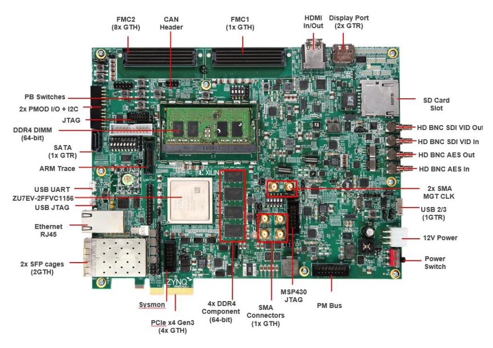 |
| --------------------------------------------------- |
| ZCU106 Evaluation Platform                          |

The ZCU106 HDMI Example Design uses the following IPs along with the Zynq UltraScale+ Processing System for demonstrating video capture, encode, decode, display and streaming using the VCU block on Zynq UltraScale+ MPSoC EV devices.

1. Zynq UltraScale+ MPSoC Processing System
2. HDMI Receiver Pipeline containing the following IPs
   - HDMI RX Subsystem
   - Video Scaler
   - Frame Buffer Write IP
3. HDMI Transmitter Pipeline containing the following IPs
   - HDMI TX Subsystem
   - Video Mixer
   - Frame Buffer Read IP
4. I2C Controller
5. Video Codec Unit (VCU)

| 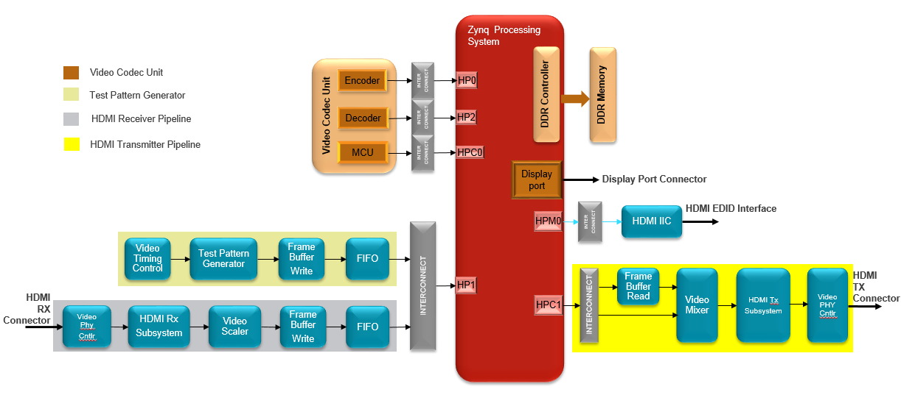 |
| ------------------------------------------------- |
| ZCU106 HDMI Example Design Block Diagram          |

# Download, Installation and Licensing

The [Vivado Design Suite User Guide](https://www.xilinx.com/support/documentation/sw_manuals/xilinx2017_3/ug973-vivado-release-notes-install-license.pdf) explains how to download and install the Vivado® Design Suite tools, which includes the Vivado Integrated Design Environment (IDE), High Level Synthesis tool, and System Generator for DSP. This guide also provides the information about licensing and administering evaluation and full copies of Xilinx design tools and intellectual property (IP) products. The Vivado Design Suite can be downloaded from [here](https://www.xilinx.com/support/download.html).

- LogiCORE IP Licensing

The following IP cores require a license to build the design

- - Video Test Pattern Generator (TPG) - Free License but must be downloaded
  - Video Timing controller (VTC) - Free License but must be downloaded
  - Video Mixer- Purchase license (Hardware evaluation available)
  - Video PHY Controller - Free License but must be downloaded
  - HDMI Rx/Tx Subsystem - Purchase license (Hardware evaluation available)

To obtain the LogiCORE IP license, please visit the respective IP product page and get the license.

- - [AR# 44029](https://www.xilinx.com/support/answers/44029.html) - Licensing - LogiCORE IP Core licensing questions?
  - [Xilinx Licensing FAQ](https://www.xilinx.com/products/design-tools/faq.html)
  - [LogiCORE IP Project License Terms](https://www.xilinx.com/products/intellectual-property/license/project-license-agreement.html)

# Building the Hardware and Software

This user guide is accompanied by a ZCU106 HDMI Example Design files ([zcu106_hdmi_ex_2018.1.zip](https://secure.xilinx.com/webreg/clickthrough.do?cid=46eb59a1-25cc-409b-862f-26ce6a72329a&license=RefDesLicense&filename=zcu106_hdmi_ex_v2018.1.zip&languageID=1)).
Download this zip file to your local directory or folder of your Windows or Linux machine to run the hardware and software building steps as mentioned in the further sections of this document.

Refer to the Vivado Design Suite User Guide UG973 (v2018.1) for setting up Vivado 2018.1 environment.

NOTE:

- It is recommended to use the Linux for building the Vivado project.
- In Windows, if the path length is more than 260 characters, then design implementation using the Vivado Design Suite might fail. This is due to a Windows OS limitation. Refer to the [AR# 52787](https://www.xilinx.com/support/answers/52787.html) for the possible solution to avoid the Windows specific path length issue.

## Building Hardware Design

This sections explains the steps to build the ZCU106 HDMI Example design.

- On Linux:

  - Open a Linux terminal

  - Change directory to download folder where the "

    zcu106_hdmi_ex_2018.1.zip

    " file exist

    - % cd <path_to_zcu106_hdmi_ex_2018.1.zip_file>
    - % unzip zcu106_hdmi_ex_2018.1.zip

  - Export the path of ZCU106 HDMI design package to HDMI_DESIGN_PKG flag, as shown below

    - % export HDMI_DESIGN_PKG=path_to_folder_zcu106_hdmi_ex_2018.1

  - Change directory to "zcu106_hdmi_ex_2018.1/hw"

    - % cd $HDMI_DESIGN_PKG/hw
    - % vivado -source zcu106_hdmi_ref.tcl

- On Windows 7:
  - Click Start -> All Programs -> Xilinx Design Tools -> Vivado 2018.1 -> Vivado 2018.1
  - On the getting started page, click on Tcl Console, see the below figure.
  - In the Tcl console type:
    - % cd </path/to/downloaded/zip-file>/zcu106_hdmi_ex_2018.1/hw
    - % source zcu106_hdmi_ref.tcl

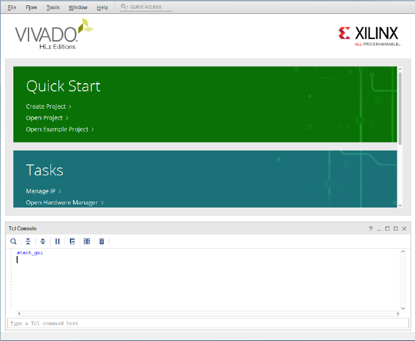

- - - After executing the script, the vivado IPI block design comes up as shown in the below Figure.

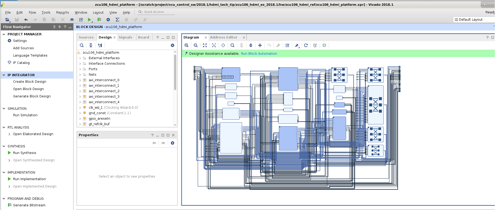

- - - Click on "**Generate Bitstream**", under "**Flow Navigator**" -> "**Program and Debug**", in the Vivado design GUI.
    - Click on "**OK**" in the Generate Bitstream dialog that pops-up.
    - The design is implemented and a pop-up window comes up saying “**Open Implemented Design**”. Click "**OK**".

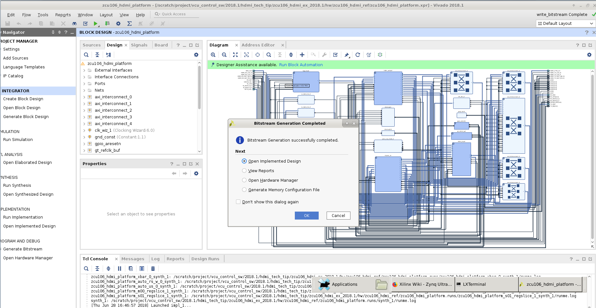

- - - After opening implemented design, the window looks as shown in the below figure.

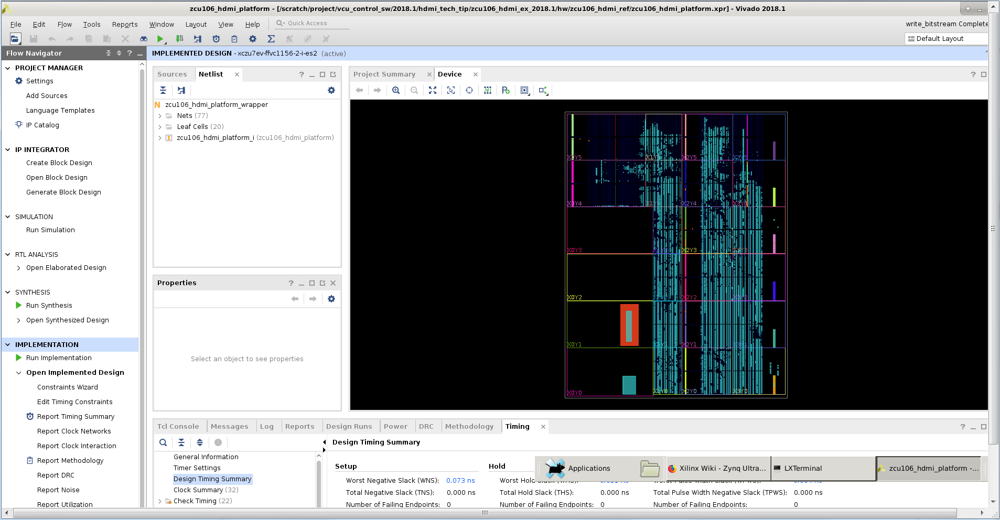

- - - Go to **File** -> **Export** -> **Export Hardware**

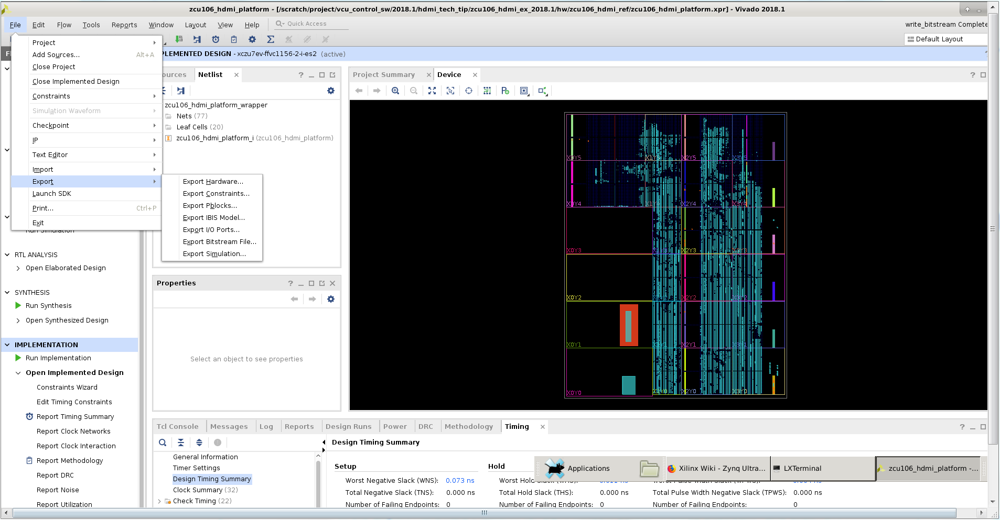

- - - In the Export Hardware Platform for SDK window select "**Include bitstream**" and click "**OK**".

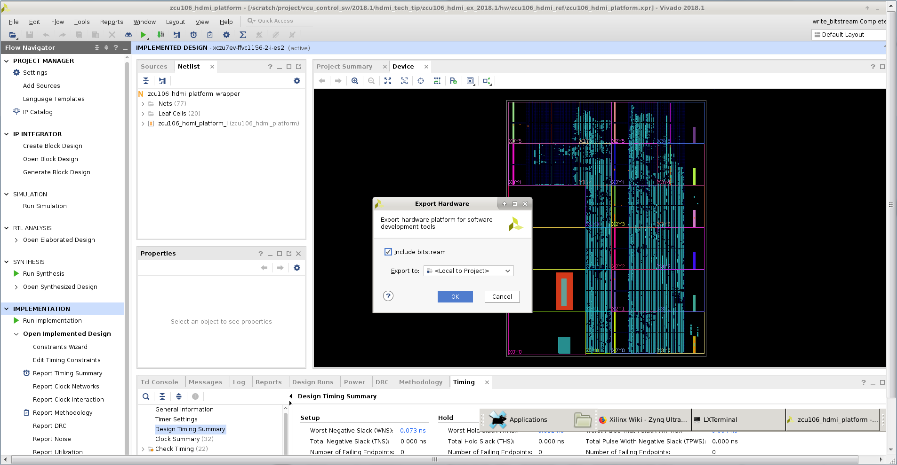

- The HDF is created at **$HDMI_DESIGN_PKG/hw/zcu106_hdmi_ref/zcu106_hdmi_platform.sdk/zcu106_hdmi_platform_wrapper.hdf**

## **Building software components**

This tutorial shows how to build the Linux image and boot image using the PetaLinux build tool.
Refer to the [PetaLinux Tools Documentation](https://www.xilinx.com/support/documentation/sw_manuals/xilinx2017_2/ug1144-petalinux-tools-reference-guide.pdf) (UG1144) for installation.

- % source <path/to/petalinux-installer>/Petalinux-v2018.1/petalinux-v2018.1-final/settings.sh
- % echo $PETALINUX
  - Post PetaLinux installation $PETALINUX environment variable should be set.
  - Configure the PetaLinux project.
- % cd $HDMI_DESIGN_PKG/sw/zcu106_petalinux_bsp/
  - Configure the petalinux project with generated hardware description file.
- % petalinux-config --get-hw-description=$HDMI_DESIGN_PKG/hw/zcu106_hdmi_ref/zcu106_hdmi_platform.sdk --oldconfig
- % petalinux-build
- Create a boot image (BOOT.BIN) including FSBL, u-boot, pmufw and bitstream.
  - % cd images/linux
  - % petalinux-package --boot --fsbl zynqmp_fsbl.elf --u-boot u-boot.elf --pmufw pmufw.elf --fpga system.bit
- Copy the generated boot image(BOOT.BIN) and Linux image(image.ub) to the SD card directory.

**Preparing the SD Cards:**

- - Preparing SD card for Board1
    - Copy BOOT.BIN, image.ub which are prepared above in build steps to SDCard.
      - **Note**: For user convenience prebuilt BOOT.bin and image.ub also provided in **$HDMI_DESIGN_PKG/ready_to_test/images** directory. Copy them to SD card in case User want to run the demo without executing the above build steps.
    - Mark this as “**Board1 SDcard**”.
    - Copy following scripts from $HDMI_DESIGN_PKG/ready_to_test/scripts/Board1 to “Board1 SDCard”
      - configure_qos.sh
      - hdmi_config_4k_abox.sh
      - hdmi_config_4k_nvidia_shield.sh
      - receive_data.sh
      - send_data.sh
    - Copy media-ctl tool from $HDMI_DESIGN_PKG/ready_to_test/tools to "Board1 SDCard"

- - Preparing SD card for Board2
    - Copy BOOT.BIN, image.ub which are prepared above in built steps to SDCard.
      - **Note**: For user convenience prebuilt BOOT.bin and image.ub also provided in **$HDMI_DESIGN_PKG/ready_to_test/images** directory. Copy them to SD card in case User want to run the demo without executing the above build steps.
    - Mark this as “**Board2 SDcard**”.
    - Copy following scripts from $HDMI_DESIGN_PKG/ready_to_test/scripts/Board2 to “Board2 SDCard”
      - configure_qos.sh
      - hdmi_config_4k_abox.sh
      - hdmi_config_4k_nvidia_shield.sh
      - receive_data.sh
      - send_data.sh
    - Copy media-ctl tool from $HDMI_DESIGN_PKG/ready_to_test/tools to "Board2 SDCard"

- - Preparing USB stick
    - Copy the [big_buck_bunny](http://distribution.bbb3d.renderfarming.net/video/mp4/bbb_sunflower_2160p_30fps_normal.mp4) video (or any other mp4 videos) to 2 pen-drives (USB sticks).

This document demonstrates following two use cases.

**Use Case 1**

: HDMI capture pipeline with VCU Encode and streaming

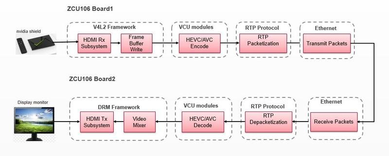

**Overview:**

This use case demonstrates video streaming using two ZCU106 boards as show in above use case diagram.
The live/raw video is captured ( in YUV format ) using HDMI Rx subsystem on the ZCU106 Board1. The captured data is encoded ( in H .265 format) using the VCU Block. The encoded data is packetized into RTP packets using RTP stack and these RTP packets are transmitted out to other ZCU106 Board 2.

The RTP packets are received, de-packetized and generates compressed stream using RTP stack on ZCU106 Board 2 .The compressed data is decoded using VCU block and rendered on to the display monitor ( which is connected to ZCU106 Board 2) using HDMI-TX subsystem.

**Use Case 2: HDMI capture pipeline with VCU Encode and streaming in bidirectional mode**

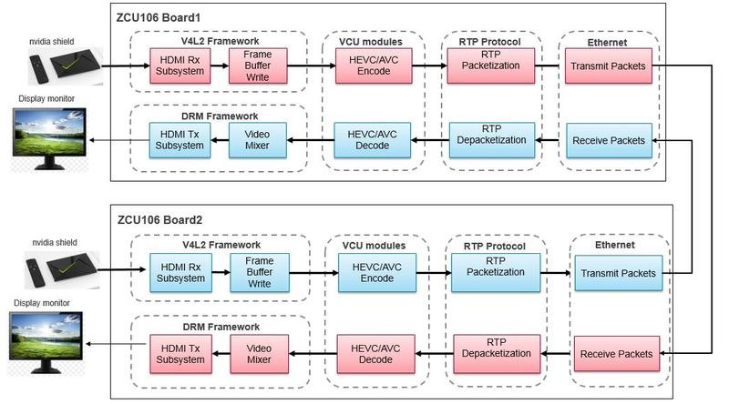

**Overview:**

This use case demonstrates video streaming using two ZCU106 boards.
The live/raw video is captured ( in YUV format ) using HDMI Rx subsystem on the ZCU106 Board1. The captured data is encoded ( in H .265 format) using the VCU Block. The encoded data is packetized into RTP packets using RTP stack and these RTP packets are transmitted out to Board 2. The RTP packets are received ,de-packetized and generates compressed stream using RTP stack on ZCU106 Board 2 .The compressed data is decoded using VCU block and rendered on to the display monitor ( which is connected to ZCU106 Board 2) using HDMI-TX subsystem. This same process happens from the Board 2 to Board 1 simultaneously in bi-directional mode .
Additional material that is not hosted in this tutorial:

• Zynq UltraScale+ MPSoC VCU TRD user guide, UG1250: The UG provides the list of features, software architecture and hardware architecture.

**Running the Use Cases:**

This section instructs how to run the above two use cases with prebuilt binaries supplied along with this document in case user don’t want to go through all the build steps.

- Skip to the section "**Preparing the SD cards**” and follow the instruction through the end of the document to run the above listed use cases.

**Compatibility**

The Example design has been tested successfully with the following user-supplied components.

- HDMI Monitor:

| **Make/Model**    | **Resolutions**    |
| ----------------- | ------------------ |
| LG 27UD88         | 3840x2160 (30Hz)   |
| Philips BDM4350UC | 3840 x 2160 (60Hz) |

**Setting up the ZCU106 Boards:**

- **ZCU 106 Board1 Setup:**

- - Connect the Micro USB cable into the ZCU106 Board Micro USB port J83, and the other end into an open USB port on the host PC. This cable will be used for UART over USB communication.
  - Insert “**Board1 SDCard**” into the SD card slot J100.
  - Set the SW6 switches as shown in below Figure . This configures the boot settings to boot from SD.

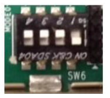

- - Connect 12V Power to the ZCU106 6-Pin Molex connector.
  - Connect one end of HDMI cable to board’s HDMI-RX (bottom) port,and, the other end to HDMI port of Nvidia shield or ABOX.
  - Connect the pen-drive (prepared above) to Nvidia shield/ABOX.
  - Connect one end of HDMI cable to board’s HDMI-TX (top) port, and,the other end to HDMI port (it should have support for HDCP 2.2) of 4K monitor
  - Connect one end of Ethernet cable to Board1’s J67 connector, and connect the other end of Ethernet cable to Board2’s J67 connector Open Tera Term utility on windows machine and Power ON the Client board.
  - Refer to **Appendix A** for Tera Term tool setup.
  - Once Tera term setup is done, power off the board

- ZCU 106 Board2 Setup:
  - Follow the procedure of “**ZCU106 Board1 Setup**”, but connect the “**Board2 SDCard**” into the SD card slot J100.
  - In this case connect one pendrive to each Nvidia sheild/ABOX.
  - Connect one end of Ethernet cable to Board2’s J67 connector, and connect the other end of Ethernet cable to Board1’s J67 connector.

Below figure show the complete board setup:

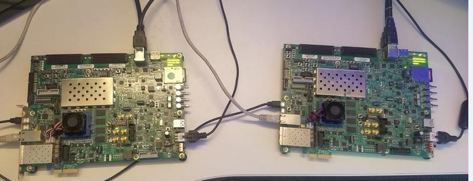

**Executing Use case 1:**

- Power on both the boards. It boots up the Linux on both the boards.
- After the Linux is boots up, make sure that HDMI display connected to the Board2 is locked to 4K60.
  - **Note**: If in case display is not locked, then restart the boards.
- Run below command on Board2
  - % /media/card/receive_data.sh
- Run below command on Board1
  - % /media/card/send_data.sh shield
    - NOTE: use **/media/card/send_data.sh abox** command, if ABOX is used as the HDMI source.

- **Observations**

  : What you will observe is,

  - SMP Linux boots up.
  - On ZCU106Board1
    - HDMI video capture (4Kp60) data will be encoded by VCU H.265 encoder and the encoded data is transmitted over Ethernet from Board1 to Board2.
  - On ZCU106Board2
    - Receives the video data from Board1, decodes and displays on 4K monitor connected to HDMI-TX on Board2.

- Below figure shows the execution result of Use Case 1

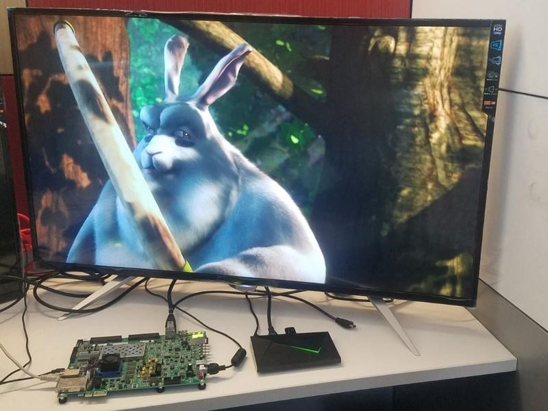

- - NOTE

    : Restart the board and follow the execution steps.

    - If any of the board is not receiving the data OR not displaying the output
    - Check whether the HDMI-TX is locked to 4Kp60 (Blue screen should be appeared on screen)
    - Check whether the HDMI-RX is locked to 4Kp60, using below command
      - \# media-ctl-d /dev/media1 -p

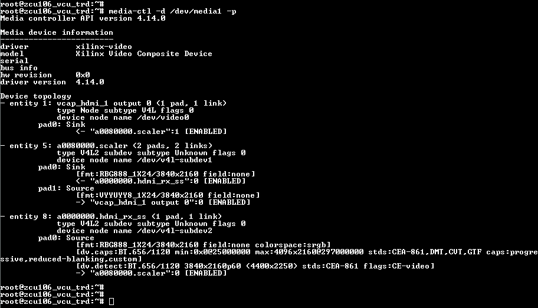

**Executing Use case 2:**

- Power on both the boards. It boots up the linux on both the boards
- After the Linux is boots up, make sure that HDMI displays connected to the Board1 and Board2 are locked to 4K60
  - Note: If in case display is not locked, then restart the boards.
- Run the below script on both the boards
  - % /media/card/receive_data.sh &
- And, run the below script on both the boards
  - % /media/card/send_data.sh shield
    - NOTE: use **/media/card/send_data/sh abox** command if ABOX is used as the HDMI source.
- Observations: What you will observe is,
  - SMP Linux boots up.
  - On ZCU106Board1
    - HDMI video capture (4Kp60) data will be encoded by VCU H.265 encoder and the encoded data is transmitted over Ethernet from Board1 to Board2.
    - Receives the video data from Board2, decodes and displays on 4K monitor connected to HDMI-TX on Board1.
  - On ZCU106Board2
    - HDMI video capture (4Kp60) data will be encoded by VCU H.265 encoder and the encoded data is transmitted over Ethernet from Board2 to Board1
    - Receives the video data from Board1, decodes and displays on 4K monitor connected to HDMI-TX on Board2.
- Below figure shows execution results of use-case 2

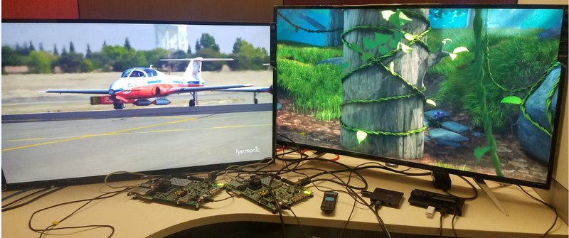

**Appendix A: Determine which COM to use to access the USB serial port on the ZCU106 board.**

- - **Note**: Make sure that the ZCU106 board is powered on and the serial UART device USB cable is in place. This ensures that the USB-to-serial bridge is enumerated by the PC host.

- Open your computer's Control Panel by clicking on **Start -> Control Panel.**

- Note that the Start button is typically located in the lower left corner of the screen. Occasionally, it is in the upper left corner.

- Click **Device Manager** to open the Device Manager window. **Note**: You may be asked to confirm opening the Device Manager. If so, click **YES**.

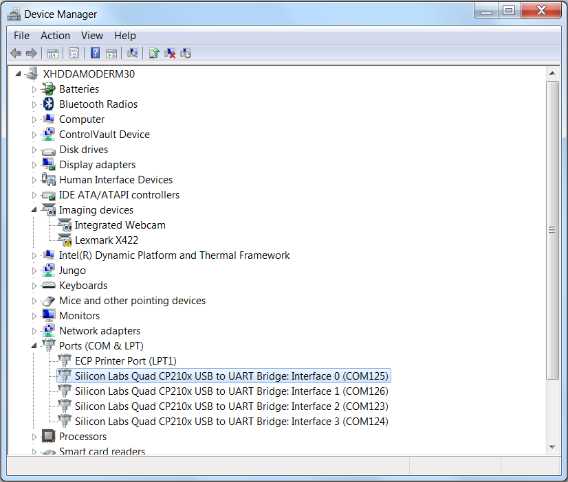

- Expand **Ports (COM & LPT)**.
- Locate the **Silicon Labs Quad CP210x USB to UART Bridge: Interface 0 (COM#)**.
- Note down the COM Port number for further steps.
- Close the Device Manager by clicking the red X in the upper right corner of the window.
- Launch any Terminal application like Tera term to view the serial messages.
- Launch Tera Term and open the COM port that is associated to **Silicon Labs Quad CP210x USB to UART Bridge: Interface 0** of the USB-to-serial bridge to both the boards.
- Set the COM port to 115200 Baud rate, 8, none, 1 –Set COM port.

**Appendix B: File Description in Design directory**
zcu106_hdmi_ex_2018.1.zip is extracted as

- hw
  - board_files
  - constrs
  - ip_repo
  - srcs
  - zcu106_hdmi_ref.tcl
- ready_to_test
  - images
    - BOOT.BIN
    - image.ub
  - scripts
    - Board1
      - configure_qos.sh
      - hdmi_config_4k_abox.sh
      - hdmi_config_4k_nvidia_shield.sh
      - receive_data.sh
      - send_data.sh
    - Board2
      - configure_qos.sh
      - hdmi_config_4k_abox.sh
      - hdmi_config_4k_nvidia_shield.sh
      - receive_data.sh
      - send_data.sh
  - tools
    - media-ctl
- sw
  - zcu106_petalinux_bsp

